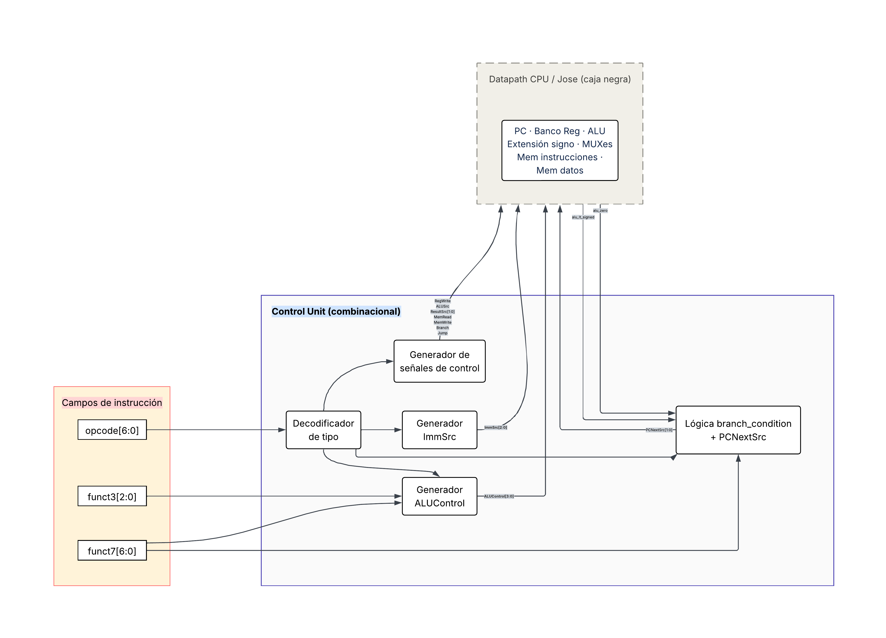

# DISENO.md — Microcontrolador RISC-V RV32I con Procesador de Texto

**Curso:** CE 3201 Taller de Diseño Digital — I Semestre 2026  
**Proyecto:** Microcontrolador RISC-V con procesador de texto  
**Equipo:** <!-- Nombres de los integrantes -->  
**Fecha:** <!-- Fecha de última actualización -->  
**Repositorio:** <!-- URL del repositorio GitLab -->

> Este documento debe completarse **antes de escribir cualquier línea de código HDL**.  
> Consulta `docs/guia_visual.md` para convenciones de diagramación y `docs/img/README.md` para nombres de archivos de imagen.

---

## 1. Metodología de diseño top-down

### 1.1 Descripción de la jerarquía de módulos

<!-- Explica brevemente cómo se aplicó el diseño modular top-down al sistema.
     Describe los niveles de jerarquía (nivel 1 → nivel 4) y por qué se eligió esa descomposición. -->

### 1.2 Criterios de descomposición modular

<!-- Describe los criterios usados para dividir el sistema en módulos:
     - Separación de responsabilidades (CPU, memoria, periféricos)
     - Independencia de interfaces
     - Reutilización y verificabilidad independiente
     - Coherencia con el mapa de memoria -->

---

## 2. Sistema completo integrado

### 2.1 Diagrama de nivel 1 — Vista de caja negra

<!-- Inserta la imagen: docs/img/nivel1_sistema.png -->

**Objetivo:** <!-- Qué resuelve el sistema completo -->

**Entradas:**

| Señal | Ancho | Función |
|-------|-------|---------|
| `clk_i` | 1 bit | Reloj principal del sistema (50 MHz) |
| `rst_i` | 1 bit | Reset activo en bajo |
| `uart_rx_i` | 1 bit | Línea de recepción UART desde PC |
| `ps2_clk_i` | 1 bit | Reloj del protocolo PS/2 |
| `ps2_data_i` | 1 bit | Datos del protocolo PS/2 |

**Salidas:**

| Señal | Ancho | Función |
|-------|-------|---------|
| `uart_tx_o` | 1 bit | Línea de transmisión UART hacia PC |
| `vga_hsync_o` | 1 bit | Sincronía horizontal VGA |
| `vga_vsync_o` | 1 bit | Sincronía vertical VGA |
| `vga_r_o` | 4 bits | Canal rojo VGA (paleta CGA) |
| `vga_g_o` | 4 bits | Canal verde VGA (paleta CGA) |
| `vga_b_o` | 4 bits | Canal azul VGA (paleta CGA) |

**Explicación general:**  
<!-- Describe en 2–3 oraciones qué hace el sistema completo desde la perspectiva del usuario -->

---

### 2.2 Diagrama de nivel 2 — Subsistemas internos

<!-- Inserta la imagen: docs/img/nivel2_sistema.png -->

**Explicación general del sistema:**  
<!-- Describe cómo interactúan los subsistemas entre sí -->

#### 2.2.1 CPU (RISC-V RV32I)

**Objetivo:**  
**Entradas:**  
**Salidas:**  
**Explicación general:**  

#### 2.2.2 Memoria ROM

**Objetivo:**  
**Entradas:**  
**Salidas:**  
**Explicación general:**  

#### 2.2.3 Memoria RAM

**Objetivo:**  
**Entradas:**  
**Salidas:**  
**Explicación general:**  

#### 2.2.4 UART

**Objetivo:**  
**Entradas:**  
**Salidas:**  
**Explicación general:**  

#### 2.2.5 PS/2

**Objetivo:**  
**Entradas:**  
**Salidas:**  
**Explicación general:**  

#### 2.2.6 Timer

**Objetivo:**  
**Entradas:**  
**Salidas:**  
**Explicación general:**  

#### 2.2.7 Controlador VGA

**Objetivo:**  
**Entradas:**  
**Salidas:**  
**Explicación general:**  

---

### 2.3 Mapa de conexiones CPU – memorias – periféricos

<!-- Inserta la imagen: docs/img/mapa_conexiones.png -->

<!-- Describe brevemente los buses principales: bus de instrucciones, bus de datos y bus de periféricos -->

---

### 2.4 Mapa de memoria

| Región | Inicio | Fin | Tamaño | Descripción |
|--------|--------|-----|--------|-------------|
| ROM (programa) | `0x0000_0000` | `0x0000_1FFF` | 8 KB | Almacena el firmware en ensamblador RV32I. Vector de reset en `0x0000_0000`. |
| RAM (datos) | `0x0000_2000` | `0x0000_2FFF` | 4 KB | Memoria de datos de lectura/escritura |
| Espacio de periféricos | `0x0001_0000` | `0x0001_FFFF` | 64 KB | Registros de control/estado/datos de periféricos |

#### Registros de periféricos

| Periférico | Registro | Offset | Dirección absoluta |
|-----------|----------|--------|--------------------|
| UART | Control/Estado | `0x00` | `0x0001_0040` |
| UART | Datos TX | `0x04` | `0x0001_0044` |
| UART | Datos RX | `0x08` | `0x0001_0048` |
| PS/2 | Control/Estado | `0x00` | `0x0001_0050` |
| PS/2 | RX | `0x04` | `0x0001_0054` |
| PS/2 | TX | `0x08` | `0x0001_0058` |
| Timer | Control/Estado | `0x00` | `0x0001_0060` |
| Timer | Datos | `0x04` | `0x0001_0064` |
| VGA | Control/Cursor | `0x00` | `0x0001_0120` |
| VGA | Buffer de texto (80×24) | — | `0x0001_1000` – `0x0001_2DFF` |

---

### 2.5 Diagrama de nivel 3 del sistema — Integración con decodificador

<!-- Inserta la imagen: docs/img/nivel3_sistema.png -->

<!-- Describe el decodificador de direcciones, las señales de chip select (CS) por módulo
     y la generación del reloj de 25 MHz para VGA -->

---

## 3. CPU RISC-V RV32I

### 3.1 Diagrama de bloques — Nivel 3

<!-- Inserta la imagen: docs/img/cpu_nivel3.png -->

<!-- Describe los bloques funcionales: PC, banco de registros, unidad de instrucción/decodificación,
     ALU, unidad de control, extensión de signo, MUXes de selección -->

### 3.2 Ruta de datos (datapath)

<!-- Inserta la imagen: docs/img/cpu_datapath.png -->

<!-- Describe el flujo de señales para al menos 3 tipos de instrucción: tipo-R, load/store, branch -->

### 3.3 Lógica combinacional de la unidad de control

El CPU implementado es **monociclo**: cada instrucción se completa en un único ciclo de reloj. En esta microarquitectura la unidad de control no requiere una FSM de estados porque no existe secuenciación temporal entre fases como fetch, decode, execute, memory access y writeback. Todos los bloques del datapath operan dentro del mismo ciclo, y la unidad de control se comporta como lógica combinacional: a partir de `opcode[6:0]`, `funct3[2:0]`, `funct7[6:0]` y las banderas de la ALU, produce el vector de señales de control correspondiente a la instrucción actual.

**Figura 3.3.** Diagrama de la unidad de control combinacional.

El diagrama representa la unidad de control como una composición de cinco bloques combinacionales: decodificador de tipo, generador de señales de control, generador de `ImmSrc`, generador de `ALUControl` y lógica de condición de branch/selección del próximo PC. Esta solución es equivalente a la FSM solicitada para diseños multiciclo, pero adaptada a la arquitectura monociclo seleccionada.

#### Descomposición interna

| Bloque | Nombre lógico | Entradas principales | Salidas principales | Función |
|--------|---------------|---------------------|---------------------|---------|
| Decodificador de tipo | `type_decoder` | `opcode[6:0]` | `type_R`, `type_I`, `type_S`, `type_B`, `type_J`, `type_U` | Identifica el formato de instrucción y activa señales internas de tipo. |
| Generador de señales de control | `ctrl_signals_gen` | Tipo de instrucción | `RegWrite`, `ALUSrc`, `ResultSrc[1:0]`, `MemRead`, `MemWrite`, `Branch`, `Jump` | Genera las señales generales del datapath. |
| Generador de `ImmSrc` | `imm_src_gen` | Tipo de instrucción | `ImmSrc[2:0]` | Selecciona el formato de inmediato que debe construir el bloque `Extend`. |
| Generador de `ALUControl` | `alu_ctrl_gen` | `opcode[6:0]`, `funct3[2:0]`, `funct7[6:0]` | `ALUControl[3:0]` | Selecciona la operación de la ALU. |
| Lógica de branch y PC | `branch_pc_logic` | `Branch`, `Jump`, `funct3[2:0]`, `alu_zero`, `alu_lt_signed` | `PCNextSrc[1:0]` | Decide si se toma un branch y selecciona la fuente del próximo PC. |

#### Justificación de la implementación combinacional

La implementación combinacional es coherente con la arquitectura monociclo porque cada instrucción usa un único ciclo de reloj. En lugar de avanzar por estados, la unidad de control evalúa directamente los campos de la instrucción y genera las señales necesarias para el datapath en ese mismo ciclo.

Esta decisión tiene tres implicaciones principales:

- **CPI = 1.** Cada instrucción ocupa un único ciclo.
- **No hay estado interno en la unidad de control.** No se requieren flip-flops ni registros de estado dentro de `control_unit`.
- **La ruta crítica define la frecuencia máxima.** La instrucción más lenta, típicamente `lw`, determina el retardo máximo permitido dentro del ciclo.

---

### 3.4 Tabla de interfaz de la unidad de control

#### Entradas

| Puerto | Ancho | Fuente en el datapath | Función |
|--------|-------|-----------------------|---------|
| `opcode_i` | 7 bits | `instr[6:0]` | Campo opcode de la instrucción actual. |
| `funct3_i` | 3 bits | `instr[14:12]` | Campo que selecciona variantes dentro de una familia de instrucciones. |
| `funct7_i` | 7 bits | `instr[31:25]` | Campo usado principalmente para distinguir `add/sub` y `srl/sra`. |
| `alu_zero_i` | 1 bit | Salida de la ALU | Indica que el resultado de la ALU es cero. Se usa para `beq` y `bne`. |
| `alu_lt_signed_i` | 1 bit | Salida de la ALU | Indica comparación menor que con signo. Se usa para `blt` y `bge`. |

#### Salidas

| Puerto | Ancho | Destino en el datapath | Función |
|--------|-------|------------------------|---------|
| `RegWrite_o` | 1 bit | Banco de registros | Habilita la escritura del registro destino. |
| `ALUSrc_o` | 1 bit | MUX de operando B de la ALU | Selecciona entre dato de registro e inmediato. |
| `ResultSrc_o` | 2 bits | MUX de dato de escritura del banco de registros | Selecciona entre resultado de ALU, dato de memoria o `PC + 4`. |
| `MemRead_o` | 1 bit | Memoria/interfaz de datos | Habilita lectura para instrucciones tipo load. |
| `MemWrite_o` | 1 bit | Memoria/interfaz de datos | Habilita escritura para instrucciones tipo store. |
| `Branch_o` | 1 bit | Lógica de branch | Indica instrucción de salto condicional. |
| `Jump_o` | 1 bit | Lógica de PC | Indica instrucción de salto incondicional (`jal` o `jalr`). |
| `ALUControl_o` | 4 bits | ALU | Selecciona la operación aritmética/lógica. |
| `ImmSrc_o` | 3 bits | Bloque `Extend` | Selecciona el formato de inmediato. |
| `PCNextSrc_o` | 2 bits | MUX del próximo PC | Selecciona la fuente del nuevo PC. |

#### Codificación de `ImmSrc`

| `ImmSrc[2:0]` | Tipo de inmediato | Uso |
|---------------|-------------------|-----|
| `000` | I-type | `addi`, `andi`, `ori`, `xori`, `slti`, `sltiu`, `lw`, `jalr`. |
| `001` | S-type | `sw`. |
| `010` | B-type | `beq`, `bne`, `blt`, `bge`. |
| `011` | J-type | `jal`. |
| `100` | U-type | `lui`, `auipc`, si se incluyen en el subconjunto implementado. |

#### Codificación de `ALUControl`

| `ALUControl[3:0]` | Operación | Instrucciones |
|-------------------|-----------|---------------|
| `0000` | ADD | `add`, `addi`, `lw`, `sw`, `jalr` y cálculo de direcciones. |
| `0001` | SUB | `sub`, `beq`, `bne`, `blt`, `bge`. |
| `0010` | AND | `and`, `andi`. |
| `0011` | OR | `or`, `ori`. |
| `0100` | XOR | `xor`, `xori`. |
| `0101` | SLL | `sll`, `slli`. |
| `0110` | SRL | `srl`, `srli`. |
| `0111` | SRA | `sra`, `srai`. |
| `1000` | SLT | `slt`, `slti`. |
| `1001` | SLTU | `sltu`, `sltiu`. |

#### Codificación de `PCNextSrc`

| `PCNextSrc[1:0]` | Fuente del próximo PC |
|------------------|-----------------------|
| `00` | `PC + 4`, ejecución secuencial. |
| `01` | Target de branch tomado. |
| `10` | Target de `jal`. |
| `11` | Target de `jalr`. |

---

### 3.5 Tabla de señales de control por tipo de instrucción

| Instrucción | Tipo | `RegWrite` | `ALUSrc` | `ResultSrc[1:0]` | `MemRead` | `MemWrite` | `Branch` | `Jump` | `ALUControl[3:0]` | `ImmSrc[2:0]` | `PCNextSrc[1:0]` |
|-------------|------|:----------:|:--------:|:----------------:|:---------:|:----------:|:--------:|:------:|:------------------:|:--------------:|:----------------:|
| `add` | R | 1 | 0 | `00` | 0 | 0 | 0 | 0 | `0000` | — | `00` |
| `sub` | R | 1 | 0 | `00` | 0 | 0 | 0 | 0 | `0001` | — | `00` |
| `and` | R | 1 | 0 | `00` | 0 | 0 | 0 | 0 | `0010` | — | `00` |
| `or` | R | 1 | 0 | `00` | 0 | 0 | 0 | 0 | `0011` | — | `00` |
| `xor` | R | 1 | 0 | `00` | 0 | 0 | 0 | 0 | `0100` | — | `00` |
| `sll` | R | 1 | 0 | `00` | 0 | 0 | 0 | 0 | `0101` | — | `00` |
| `srl` | R | 1 | 0 | `00` | 0 | 0 | 0 | 0 | `0110` | — | `00` |
| `sra` | R | 1 | 0 | `00` | 0 | 0 | 0 | 0 | `0111` | — | `00` |
| `slt` | R | 1 | 0 | `00` | 0 | 0 | 0 | 0 | `1000` | — | `00` |
| `sltu` | R | 1 | 0 | `00` | 0 | 0 | 0 | 0 | `1001` | — | `00` |
| `addi` | I | 1 | 1 | `00` | 0 | 0 | 0 | 0 | `0000` | `000` | `00` |
| `andi` | I | 1 | 1 | `00` | 0 | 0 | 0 | 0 | `0010` | `000` | `00` |
| `ori` | I | 1 | 1 | `00` | 0 | 0 | 0 | 0 | `0011` | `000` | `00` |
| `xori` | I | 1 | 1 | `00` | 0 | 0 | 0 | 0 | `0100` | `000` | `00` |
| `slli` | I | 1 | 1 | `00` | 0 | 0 | 0 | 0 | `0101` | `000` | `00` |
| `srli` | I | 1 | 1 | `00` | 0 | 0 | 0 | 0 | `0110` | `000` | `00` |
| `srai` | I | 1 | 1 | `00` | 0 | 0 | 0 | 0 | `0111` | `000` | `00` |
| `slti` | I | 1 | 1 | `00` | 0 | 0 | 0 | 0 | `1000` | `000` | `00` |
| `sltiu` | I | 1 | 1 | `00` | 0 | 0 | 0 | 0 | `1001` | `000` | `00` |
| `lw` | I | 1 | 1 | `01` | 1 | 0 | 0 | 0 | `0000` | `000` | `00` |
| `sw` | S | 0 | 1 | — | 0 | 1 | 0 | 0 | `0000` | `001` | `00` |
| `beq` | B | 0 | 0 | — | 0 | 0 | 1 | 0 | `0001` | `010` | cond. |
| `bne` | B | 0 | 0 | — | 0 | 0 | 1 | 0 | `0001` | `010` | cond. |
| `blt` | B | 0 | 0 | — | 0 | 0 | 1 | 0 | `0001` | `010` | cond. |
| `bge` | B | 0 | 0 | — | 0 | 0 | 1 | 0 | `0001` | `010` | cond. |
| `jal` | J | 1 | 1 | `10` | 0 | 0 | 0 | 1 | `0000` | `011` | `10` |
| `jalr` | I | 1 | 1 | `10` | 0 | 0 | 0 | 1 | `0000` | `000` | `11` |

Para instrucciones de branch, `PCNextSrc` depende de la evaluación de la condición. Si la condición se cumple, `PCNextSrc = 01`; si no se cumple, `PCNextSrc = 00`.

| Instrucción | Condición de salto tomado |
|-------------|--------------------------|
| `beq` | `alu_zero = 1` |
| `bne` | `alu_zero = 0` |
| `blt` | `alu_lt_signed = 1` |
| `bge` | `alu_lt_signed = 0` |

### 3.6 Nivel 4 — Fichas de módulos del CPU

#### 3.6.1 Contador de Programa (PC)

**Nombre:** `program_counter`  
**Objetivo:**  
**Entradas:**  
**Salidas:**  
**Relación con otros módulos:**  
**Funcionamiento:**  
**Justificación de diseño:**  

#### 3.6.2 Banco de Registros

**Nombre:** `register_file`  
**Objetivo:**  
**Entradas:**  
**Salidas:**  
**Relación con otros módulos:**  
**Funcionamiento:**  
**Justificación de diseño:**  

#### 3.6.3 Unidad Aritmético-Lógica (ALU)

**Nombre:** `alu`  
**Objetivo:**  
**Entradas:**  
**Salidas:**  
**Relación con otros módulos:**  
**Funcionamiento:**  
**Justificación de diseño:**  

#### 3.6.4 Unidad de Control

La unidad de control es el bloque combinacional encargado de transformar la instrucción actual y las banderas de la ALU en señales de control para el datapath.

##### Decodificador de tipo

| Campo | Descripción |
|-------|-------------|
| Nombre lógico | `type_decoder` |
| Nivel | 4 |
| Responsabilidad | Identificar el formato de instrucción a partir de `opcode[6:0]`. |
| Entradas | `opcode[6:0]` |
| Salidas internas | `type_R`, `type_I_arith`, `type_I_load`, `type_I_jalr`, `type_S`, `type_B`, `type_J`, `type_U` |
| Dependencias | Campo `opcode` de la instrucción. |
| Observaciones | Sus salidas son señales internas combinacionales utilizadas por los demás bloques de control. |

##### Generador de señales de control

| Campo | Descripción |
|-------|-------------|
| Nombre lógico | `ctrl_signals_gen` |
| Nivel | 4 |
| Responsabilidad | Generar las señales generales de control del datapath a partir del tipo de instrucción. |
| Entradas | Señales internas de tipo. |
| Salidas | `RegWrite`, `ALUSrc`, `ResultSrc[1:0]`, `MemRead`, `MemWrite`, `Branch`, `Jump` |
| Dependencias | `type_decoder`, datapath. |
| Observaciones | No depende de `funct3` ni `funct7`; solo del tipo de instrucción. |

##### Generador de `ImmSrc`

| Campo | Descripción |
|-------|-------------|
| Nombre lógico | `imm_src_gen` |
| Nivel | 4 |
| Responsabilidad | Seleccionar el esquema de inmediato que debe construir el bloque `Extend`. |
| Entradas | Señales internas de tipo. |
| Salida | `ImmSrc[2:0]` |
| Dependencias | `type_decoder`, bloque `Extend`. |
| Observaciones | Para instrucciones tipo R, el valor de `ImmSrc` no afecta la ejecución. |

##### Generador de `ALUControl`

| Campo | Descripción |
|-------|-------------|
| Nombre lógico | `alu_ctrl_gen` |
| Nivel | 4 |
| Responsabilidad | Determinar la operación de la ALU. |
| Entradas | `opcode[6:0]`, `funct3[2:0]`, `funct7[6:0]`, señales internas de tipo. |
| Salida | `ALUControl[3:0]` |
| Dependencias | ALU del datapath. |
| Observaciones | Para loads y stores fuerza ADD; para branches habilita la operación necesaria para generar banderas de comparación. |

##### Lógica `branch_condition` y `PCNextSrc`

| Campo | Descripción |
|-------|-------------|
| Nombre lógico | `branch_pc_logic` |
| Nivel | 4 |
| Responsabilidad | Evaluar condiciones de branch y seleccionar la fuente del próximo PC. |
| Entradas | `Branch`, `Jump`, `funct3[2:0]`, `alu_zero`, `alu_lt_signed`, `type_I_jalr` |
| Salida | `PCNextSrc[1:0]` |
| Dependencias | Banderas de la ALU y MUX de selección del próximo PC. |
| Observaciones | Es el único submódulo de la unidad de control que recibe retroalimentación combinacional desde la ALU. |

| `funct3[2:0]` | Instrucción | Condición |
|---------------|-------------|-----------|
| `000` | `beq` | Salta si `alu_zero = 1`. |
| `001` | `bne` | Salta si `alu_zero = 0`. |
| `100` | `blt` | Salta si `alu_lt_signed = 1`. |
| `101` | `bge` | Salta si `alu_lt_signed = 0`. |

| `PCNextSrc[1:0]` | Fuente del próximo PC |
|------------------|-----------------------|
| `00` | `PC + 4`. |
| `01` | Target de branch tomado. |
| `10` | Target de `jal`. |
| `11` | Target de `jalr`. |

#### 3.6.5 Extensión de Signo

**Nombre:** `sign_extend`  
**Objetivo:**  
**Entradas:**  
**Salidas:**  
**Relación con otros módulos:**  
**Funcionamiento:**  
**Justificación de diseño:**  

---

## 4. Periférico UART

### 4.1 Diagrama de bloques — Nivel 3

**Figura 4.1.** Diagrama de nivel 3 del periférico UART 115200-8N1.

El periférico UART se descompone en tres bloques principales: la interfaz de bus `uart_bus_if`, el banco de registros mapeados en memoria y el núcleo UART 115200-8N1. Esta división permite separar la comunicación con el bus del sistema, el almacenamiento de datos y control visible por software, y la lógica serial encargada de transmitir y recibir tramas UART.

El módulo `uart_bus_if` recibe los accesos provenientes del bus de interconexión mediante las señales `addr[31:0]`, `wdata[31:0]`, `we`, `re` y `cs_uart`. A partir de estas señales genera operaciones internas de lectura y escritura sobre los registros UART y responde hacia el bus con `uart_rdata[31:0]` y `uart_ready`.

Los registros mapeados en memoria son `CTRL/STATUS` en `0x0001_0040`, `TXDATA` en `0x0001_0044` y `RXDATA` en `0x0001_0048`. El registro `CTRL/STATUS` concentra señales de habilitación, control y estado. `TXDATA` almacena el byte que será transmitido por `uart_tx`; su escritura genera `tx_start`. `RXDATA` almacena el byte entregado por `uart_rx`; su lectura limpia la bandera `rx_ready`.

El núcleo UART implementa la comunicación serial con configuración 115200-8N1: 115200 baudios, 8 bits de datos, sin paridad y 1 bit de parada. Se divide en `baud_gen`, `uart_tx` y `uart_rx`. El generador de baud rate deriva los pulsos de temporización a partir del reloj de 50 MHz usando aproximadamente 434 ciclos por bit.

**Submódulos representados en el nivel 3:**

| Bloque | Nombre lógico | Función |
|--------|---------------|---------|
| Interfaz de bus | `uart_bus_if` | Traduce accesos del bus en operaciones de lectura/escritura sobre registros UART. |
| Registro de control/estado | `CTRL/STATUS` | Expone banderas de estado y señales de habilitación. |
| Registro de transmisión | `TXDATA` | Almacena el byte a transmitir y genera `tx_start`. |
| Registro de recepción | `RXDATA` | Almacena el byte recibido y permite su lectura por software. |
| Generador de baud rate | `baud_gen` | Genera `baud_tick` y `sample_tick`. |
| Transmisor UART | `uart_tx` | Serializa una trama `start · 8 data · stop`. |
| Receptor UART | `uart_rx` | Reconstruye el byte recibido y genera `rx_ready`/`rx_error`. |

**Conexiones principales del nivel 3:**

| Origen | Destino | Señales |
|--------|---------|---------|
| Bus e interconexión | `uart_bus_if` | `addr[31:0]`, `wdata[31:0]`, `we`, `re`, `cs_uart` |
| `uart_bus_if` | Bus e interconexión | `uart_rdata[31:0]`, `uart_ready` |
| `uart_bus_if` | `CTRL/STATUS` | `wr_ctrl`, `rd_status` |
| `uart_bus_if` | `TXDATA` | `wr_tx_data[7:0]` |
| `RXDATA` | `uart_bus_if` | `rd_rx_data[7:0]` |
| `CTRL/STATUS` | Núcleo UART | `tx_enable`, `rx_enable`, `clear_flags` |
| `TXDATA` | `uart_tx` | `tx_data[7:0]`, `tx_start` |
| `uart_rx` | `RXDATA` | `rx_data[7:0]` |
| `uart_rx` | `CTRL/STATUS` | `rx_ready`, `rx_error` |
| `uart_tx` | `CTRL/STATUS` | `tx_busy`, `tx_ready` |
| `baud_gen` | `uart_tx` | `baud_tick` |
| `baud_gen` | `uart_rx` | `sample_tick` |
| Señal externa | `uart_rx` | `uart_rx_i` |
| `uart_tx` | Señal externa | `uart_tx_o` |

---

### 4.2 FSM del transmisor y receptor UART

#### FSM del transmisor (`uart_tx`)

| Estado | Condición de salida | Próximo estado | Señales activas |
|--------|--------------------|----------------|-----------------|
| `IDLE` | `tx_start = 1` | `START` | `tx_ready = 1`, `uart_tx_o = 1` |
| `START` | `baud_tick = 1` | `DATA` | `uart_tx_o = 0`, `tx_busy = 1` |
| `DATA` | `baud_tick = 1` y `bit_count < 8` | `DATA` | Transmite `tx_shift[0]` y desplaza el registro |
| `DATA` | `baud_tick = 1` y `bit_count = 8` | `STOP` | Último bit enviado |
| `STOP` | `baud_tick = 1` | `IDLE` | `uart_tx_o = 1`, `tx_ready = 1` |

#### FSM del receptor (`uart_rx`)

| Estado | Condición de salida | Próximo estado | Señales activas |
|--------|--------------------|----------------|-----------------|
| `IDLE` | Flanco descendente en `uart_rx_i` | `START` | Espera bit de inicio |
| `START` | `sample_tick = 1` y `uart_rx_i = 0` | `DATA` | Valida bit de inicio |
| `START` | `sample_tick = 1` y `uart_rx_i = 1` | `IDLE` | Descarta glitch |
| `DATA` | `sample_tick = 1` y `bit_count < 8` | `DATA` | Captura bit en `rx_shift` |
| `DATA` | `sample_tick = 1` y `bit_count = 8` | `STOP` | Byte completo |
| `STOP` | `sample_tick = 1` y `uart_rx_i = 1` | `IDLE` | `rx_ready = 1`, `rx_data = rx_shift` |
| `STOP` | `sample_tick = 1` y `uart_rx_i = 0` | `IDLE` | `rx_error = 1` |

---

### 4.3 Tabla de interfaz de puertos

| Puerto | Dirección | Ancho | Función |
|--------|-----------|-------|---------|
| `clk_i` | Entrada | 1 bit | Reloj del sistema de 50 MHz. |
| `rst_i` | Entrada | 1 bit | Reset activo en bajo. |
| `addr_i` | Entrada | 32 bits | Dirección del registro accedido. |
| `wdata_i` | Entrada | 32 bits | Dato de escritura desde el bus. |
| `we_i` | Entrada | 1 bit | Habilitación de escritura. |
| `re_i` | Entrada | 1 bit | Habilitación de lectura. |
| `cs_uart_i` | Entrada | 1 bit | Chip select del periférico UART. |
| `uart_rdata_o` | Salida | 32 bits | Dato de lectura hacia el bus. |
| `uart_ready_o` | Salida | 1 bit | Respuesta válida del periférico. |
| `uart_rx_i` | Entrada | 1 bit | Línea serial de recepción. |
| `uart_tx_o` | Salida | 1 bit | Línea serial de transmisión. |

---

### 4.4 Nivel 4 — Fichas de módulos del UART

El periférico UART se descompone en una interfaz de bus, tres registros mapeados en memoria y un núcleo serial 115200-8N1 compuesto por generador de baud rate, transmisor y receptor.

#### 4.4.1 Interfaz de bus UART

| Campo                | Descripción                                                                               |
| -------------------- | ----------------------------------------------------------------------------------------- |
| Nombre lógico        | `uart_bus_if`                                                                             |
| Nivel                | 4                                                                                         |
| Responsabilidad      | Traducir accesos del bus hacia operaciones de lectura/escritura sobre los registros UART. |
| Entradas principales | `addr[31:0]`, `wdata[31:0]`, `we`, `re`, `cs_uart`, `status[31:0]`, `rx_data[7:0]`        |
| Salidas principales  | `uart_rdata[31:0]`, `uart_ready`, `wr_ctrl`, `rd_status`, `wr_tx_data[7:0]`, `rd_rx_data` |
| Dependencias         | Bus e interconexión, `CTRL/STATUS`, `TXDATA`, `RXDATA`.                                   |
| Observaciones        | Decodifica las direcciones `0x0001_0040`, `0x0001_0044` y `0x0001_0048`.                  |

| Dirección     | Registro seleccionado | Operación                                    |
| ------------- | --------------------- | -------------------------------------------- |
| `0x0001_0040` | `CTRL/STATUS`         | Lectura de estado / escritura de control. |
| `0x0001_0044` | `TXDATA`              | Escritura del byte a transmitir.             |
| `0x0001_0048` | `RXDATA`              | Lectura del byte recibido.                   |

#### 4.4.2 Registro CTRL/STATUS del UART

| Campo                | Descripción                                                                                               |
| -------------------- | --------------------------------------------------------------------------------------------------------- |
| Nombre lógico        | `uart_ctrl_status`                                                                                        |
| Nivel                | 4                                                                                                         |
| Dirección            | `0x0001_0040`                                                                                             |
| Responsabilidad      | Exponer el estado básico del UART y almacenar señales de control del periférico.                          |
| Entradas principales | `wr_ctrl`, `wdata[31:0]`, `rx_ready`, `rx_error`, `tx_busy`, `tx_ready`, `rd_rx_data`.                    |
| Salidas principales  | `status[31:0]`, `tx_enable`, `rx_enable`, `clear_flags`.                                                  |
| Dependencias         | `uart_bus_if`, `uart_rx`, `uart_tx`.                                                                      |
| Observaciones        | Los bits no definidos se mantienen reservados y se leen como 0. La lectura de `RXDATA` limpia `rx_ready`. |

| Señal | Tipo | Descripción |
|-------|------|-------------|
| `tx_ready` | RO | El transmisor está libre para aceptar un nuevo byte. |
| `tx_busy` | RO | Hay una transmisión en curso. |
| `rx_ready` | RO | Hay un byte disponible en `RXDATA`. |
| `rx_error` | RO | Error de recepción UART. |
| `tx_enable` | R/W | Habilita el transmisor UART. |
| `rx_enable` | R/W | Habilita el receptor UART. |
| `clear_flags` | WO | Limpia banderas de estado/error. |

#### 4.4.3 Registro TXDATA del UART

| Campo                | Descripción                                                                           |
| -------------------- | ------------------------------------------------------------------------------------- |
| Nombre lógico        | `uart_txdata`                                                                         |
| Nivel                | 4                                                                                     |
| Dirección            | `0x0001_0044`                                                                         |
| Responsabilidad      | Almacenar el byte que será transmitido por el UART.                                   |
| Entradas principales | `wr_tx_data[7:0]`, pulso de escritura desde `uart_bus_if`.                            |
| Salidas principales  | `tx_data[7:0]`, `tx_start` hacia `uart_tx`. |                    
| Dependencias         | `uart_bus_if`, `uart_tx`.                                                             |
| Observaciones        | La escritura en este registro carga `tx_data[7:0]` y genera el pulso interno `tx_start` hacia `uart_tx`. |

#### 4.4.4 Registro RXDATA del UART

| Campo                | Descripción                                                                                |
| -------------------- | ------------------------------------------------------------------------------------------ |
| Nombre lógico        | `uart_rxdata`                                                                              |
| Nivel                | 4                                                                                          |
| Dirección            | `0x0001_0048`                                                                              |
| Responsabilidad      | Almacenar el byte recibido por `uart_rx`.                                                  |
| Entradas principales | `rx_data[7:0]`, `rx_ready`.                                                                |
| Salidas principales  | `rx_data[7:0]` hacia `uart_bus_if`.                                                        |
| Dependencias         | `uart_rx`, `uart_bus_if`, `CTRL/STATUS`.                                                   |
| Observaciones        | La lectura de este registro genera `rd_rx_data`, usado para limpiar la bandera `rx_ready`. |

#### 4.4.5 Generador de baud rate

| Campo                | Descripción                                                                               |
| -------------------- | ----------------------------------------------------------------------------------------- |
| Nombre lógico        | `baud_gen`                                                                                |
| Nivel                | 4                                                                                         |
| Responsabilidad      | Generar pulsos de temporización para transmisión y recepción UART a 115200 baudios.       |
| Entradas principales | Reloj del sistema de 50 MHz.                                                              |
| Salidas principales  | `baud_tick`, `sample_tick`.                                                               |
| Dependencias         | `uart_tx`, `uart_rx`.                                                                     |
| Observaciones        | Usa aproximadamente 434 ciclos de reloj por bit para obtener 115200 baudios desde 50 MHz. |

| Señal         | Destino   | Descripción                                          |
| ------------- | --------- | ---------------------------------------------------- |
| `baud_tick`   | `uart_tx` | Marca la cadencia de transmisión de cada bit.        |
| `sample_tick` | `uart_rx` | Marca el instante de muestreo de los bits recibidos. |

#### 4.4.6 Transmisor UART

| Campo                | Descripción                                                              |
| -------------------- | ------------------------------------------------------------------------ |
| Nombre lógico        | `uart_tx`                                                                |
| Nivel                | 4                                                                        |
| Responsabilidad      | Serializar un byte en una trama UART 8N1 y transmitirla por `uart_tx_o`. |
| Entradas principales | `tx_data[7:0]`, `tx_start`, `baud_tick`.                                 |
| Salidas principales | `uart_tx_o`, `tx_busy`, `tx_ready`. |                                               
| Dependencias         | `TXDATA`, `CTRL/STATUS`, `baud_gen`.                                     |
| Observaciones        | La FSM interna recorre los estados `IDLE`, `START`, `DATA` y `STOP`.     |

#### 4.4.7 Receptor UART

| Campo                | Descripción                                                                    |
| -------------------- | ------------------------------------------------------------------------------ |
| Nombre lógico        | `uart_rx`                                                                      |
| Nivel                | 4                                                                              |
| Responsabilidad      | Recibir una trama UART 8N1, reconstruir el byte y generar la señal `rx_ready`. |
| Entradas principales | `uart_rx_i`, `sample_tick`.                                                    |
| Salidas principales | `rx_data[7:0]`, `rx_ready`, `rx_error`. |                                                  
| Dependencias         | `baud_gen`, `RXDATA`, `CTRL/STATUS`.                                           |
| Observaciones        | La FSM interna recorre los estados `IDLE`, `START`, `DATA` y `STOP`.           |

## 5. Periférico PS/2

### 5.1 Diagrama de bloques — Nivel 3

**Figura 5.1.** Diagrama de nivel 3 del periférico PS/2.

El periférico PS/2 se descompone en una interfaz de bus `ps2_bus_if`, un banco de registros mapeados en memoria, una cadena de recepción y un transmisor de comandos. Esta organización separa la comunicación con el bus del sistema, el almacenamiento visible por software y la lógica propia del protocolo PS/2.

El módulo `ps2_bus_if` recibe los accesos provenientes del bus de interconexión mediante `addr[31:0]`, `wdata[31:0]`, `we`, `re` y `cs_ps2`. Genera operaciones internas de lectura/escritura sobre los registros y responde con `ps2_rdata[31:0]` y `ps2_ready`.

Los registros mapeados en memoria son `CTRL/STATUS` en `0x0001_0050`, `RXDATA` en `0x0001_0054` y `TXDATA` en `0x0001_0058`. `CTRL/STATUS` expone `rx_ready`, `tx_ready`, `rx_error`, `tx_error` y `kbd_enable`. `RXDATA` almacena el scancode recibido y `TXDATA` almacena el comando que será enviado al teclado.

La cadena de recepción sincroniza `ps2_clk_i` y `ps2_data_i`, detecta flancos descendentes, captura una trama de 11 bits, verifica paridad impar y stop, procesa prefijos `0xF0`/`0xE0` y entrega el scancode Set 2 final. Las señales `is_break` e `is_extended` son internas entre el manejo de prefijos y el decodificador; no son bits visibles de `CTRL/STATUS`.

**Submódulos representados en el nivel 3:**

| Bloque | Nombre lógico | Función |
|--------|---------------|---------|
| Interfaz de bus | `ps2_bus_if` | Traduce accesos del bus en operaciones de lectura/escritura sobre registros PS/2. |
| Registro de control/estado | `CTRL/STATUS` | Expone `rx_ready`, `tx_ready`, `rx_error`, `tx_error` y `kbd_enable`. |
| Registro de recepción | `RXDATA` | Almacena `scancode[7:0]`. |
| Registro de transmisión | `TXDATA` | Almacena el comando y genera `tx_start`. |
| Sincronizador/detector de flanco | `ps2_sync` | Sincroniza `ps2_clk_i` y `ps2_data_i`; detecta `fall_edge`. |
| FSM de recepción | `ps2_rx_fsm` | Controla la captura de los 11 bits. |
| Receptor de trama | `ps2_rx_frame` | Captura `start · 8 data · parity · stop`. |
| Verificador de paridad | `ps2_parity_chk` | Valida paridad impar y stop. |
| Manejo de prefijos | `ps2_prefix` | Detecta `0xF0` y `0xE0`. |
| Decodificador Set 2 | `ps2_decoder` | Produce `scancode[7:0]` y `rx_ready`. |
| Transmisor de comandos | `ps2_tx` | Envía comandos host-a-teclado y espera ACK. |

**Conexiones principales del nivel 3:**

| Origen | Destino | Señales |
|--------|---------|---------|
| Bus e interconexión | `ps2_bus_if` | `addr[31:0]`, `wdata[31:0]`, `we`, `re`, `cs_ps2` |
| `ps2_bus_if` | Bus e interconexión | `ps2_rdata[31:0]`, `ps2_ready` |
| `ps2_bus_if` | `CTRL/STATUS` | `wr_ctrl`, `rd_status` |
| `ps2_bus_if` | `TXDATA` | `wr_tx_data[7:0]` |
| `RXDATA` | `ps2_bus_if` | `rd_rx_data[7:0]` |
| `CTRL/STATUS` | `ps2_rx_fsm` | `kbd_enable`, `clear_flags` |
| Señales externas | `ps2_sync` | `ps2_clk_i`, `ps2_data_i` |
| `ps2_sync` | `ps2_rx_fsm` | `fall_edge`, `ps2_data_sync` |
| `ps2_rx_fsm` | `ps2_rx_frame` | `bit_shift`, `bit_count` |
| `ps2_rx_frame` | `ps2_parity_chk` | `frame[10:0]`, `rx_byte[7:0]` |
| `ps2_parity_chk` | `ps2_prefix` | `frame_ok`, `parity_ok`, `rx_byte[7:0]` |
| `ps2_parity_chk` | `CTRL/STATUS` | `rx_error` |
| `ps2_prefix` | `ps2_decoder` | `rx_byte[7:0]`, `is_break`, `is_extended` |
| `ps2_decoder` | `RXDATA` | `scancode[7:0]` |
| `ps2_decoder` | `CTRL/STATUS` | `rx_ready` |
| `TXDATA` | `ps2_tx` | `tx_data[7:0]`, `tx_start` |
| `ps2_tx` | `CTRL/STATUS` | `tx_ready`, `tx_error` |
| `ps2_tx` | Señales externas | `ps2_clk_o`, `ps2_data_o` |

---

### 5.2 FSM de recepción PS/2

| Estado | Descripción | Condición de salida | Próximo estado | Señales activas |
|--------|-------------|---------------------|----------------|-----------------|
| `IDLE` | Espera el bit de inicio | `fall_edge = 1` y `ps2_data_sync = 0` | `SHIFT` | Reinicia `bit_count` |
| `IDLE` | Flanco no válido | `fall_edge = 1` y `ps2_data_sync = 1` | `IDLE` | Descarta glitch |
| `SHIFT` | Captura bits de datos y paridad | `fall_edge = 1` y `bit_count < 9` | `SHIFT` | `bit_shift = 1` |
| `SHIFT` | Captura completa de datos/paridad | `fall_edge = 1` y `bit_count = 9` | `CHECK` | `bit_shift = 1` |
| `CHECK` | Evalúa stop y paridad | Stop/paridad válidos | `DONE` | `frame_ok = 1` |
| `CHECK` | Error de trama | Stop/paridad inválidos | `ERROR` | `rx_error = 1` |
| `DONE` | Entrega byte a prefijos/decodificador | Siempre | `IDLE` | `rx_ready` vía decodificador |
| `ERROR` | Descarta trama | Siempre | `IDLE` | `rx_error = 1` |

#### Manejo de prefijos `0xF0` y `0xE0`

Cuando se recibe `0xF0`, el bloque de prefijos activa internamente `is_break` para indicar que el siguiente scancode corresponde a liberación de tecla. Cuando se recibe `0xE0`, activa `is_extended` para indicar una tecla extendida. Ambas señales son internas al camino `ps2_prefix` → `ps2_decoder` y no se exponen como bits de `CTRL/STATUS`.

---

### 5.3 Tabla de interfaz de puertos

| Puerto | Dirección | Ancho | Función |
|--------|-----------|-------|---------|
| `clk_i` | Entrada | 1 bit | Reloj del sistema. |
| `rst_i` | Entrada | 1 bit | Reset activo en bajo. |
| `addr_i` | Entrada | 32 bits | Dirección del registro accedido. |
| `wdata_i` | Entrada | 32 bits | Dato de escritura desde el bus. |
| `we_i` | Entrada | 1 bit | Habilitación de escritura. |
| `re_i` | Entrada | 1 bit | Habilitación de lectura. |
| `cs_ps2_i` | Entrada | 1 bit | Chip select del periférico PS/2. |
| `ps2_rdata_o` | Salida | 32 bits | Dato de lectura hacia el bus. |
| `ps2_ready_o` | Salida | 1 bit | Respuesta válida del periférico. |
| `ps2_clk_i` | Entrada | 1 bit | Reloj PS/2 desde teclado. |
| `ps2_data_i` | Entrada | 1 bit | Datos PS/2 desde teclado. |
| `ps2_clk_o` | Salida | 1 bit | Control de reloj PS/2 durante transmisión. |
| `ps2_data_o` | Salida | 1 bit | Control de datos PS/2 durante transmisión. |

> **Nota de implementación:** Las líneas físicas `ps2_clk` y `ps2_data` son bidireccionales. En FPGA pueden modelarse como pares entrada/salida más lógica de habilitación o mediante buffers triestado según la integración de pines.

---

### 5.4 Nivel 4 — Fichas de módulos del PS/2

El periférico PS/2 se descompone en una interfaz de bus, registros mapeados en memoria y un núcleo PS/2 encargado de recibir scancodes Set 2 y transmitir comandos al teclado.

#### 5.4.1 Interfaz de bus PS/2

| Campo | Descripción |
|-------|-------------|
| Nombre lógico | `ps2_bus_if` |
| Nivel | 4 |
| Responsabilidad | Traducir accesos del bus hacia operaciones de lectura/escritura sobre registros PS/2. |
| Entradas principales | `addr[31:0]`, `wdata[31:0]`, `we`, `re`, `cs_ps2`, `status[31:0]`, `rx_data[7:0]` |
| Salidas principales | `ps2_rdata[31:0]`, `ps2_ready`, `wr_ctrl`, `rd_status`, `wr_tx_data[7:0]`, `rd_rx_data` |
| Dependencias | Bus e interconexión, `CTRL/STATUS`, `RXDATA`, `TXDATA`. |
| Observaciones | Decodifica `0x0001_0050`, `0x0001_0054` y `0x0001_0058`. |

#### 5.4.2 Registro CTRL/STATUS del PS/2

| Campo | Descripción |
|-------|-------------|
| Nombre lógico | `ps2_ctrl_status` |
| Nivel | 4 |
| Dirección | `0x0001_0050` |
| Responsabilidad | Almacenar banderas de estado y el bit de habilitación del teclado. |
| Entradas principales | `wr_ctrl`, `wdata[31:0]`, `rx_ready`, `tx_ready`, `rx_error`, `tx_error`, `rd_rx_data`. |
| Salidas principales | `status[31:0]`, `kbd_enable`, `clear_flags`. |
| Dependencias | `ps2_bus_if`, receptor PS/2, transmisor PS/2. |
| Observaciones | `is_break` e `is_extended` son señales internas y no forman parte de este registro. |

| Bit | Señal | Tipo | Descripción |
|-----|-------|------|-------------|
| 0 | `rx_ready` | RO | Scancode disponible en `RXDATA`. |
| 1 | `tx_ready` | RO | Transmisor disponible. |
| 2 | `rx_error` | RO | Error de paridad o enmarcado. |
| 3 | `tx_error` | RO | Error de transmisión o ausencia de ACK. |
| 4 | `kbd_enable` | R/W | Habilita recepción del teclado. |

#### 5.4.3 Registro RXDATA del PS/2

| Campo | Descripción |
|-------|-------------|
| Nombre lógico | `ps2_rxdata` |
| Nivel | 4 |
| Dirección | `0x0001_0054` |
| Responsabilidad | Almacenar el scancode válido entregado por el decodificador. |
| Entradas principales | `scancode[7:0]`, `rx_ready`. |
| Salidas principales | `rx_data[7:0]` hacia `ps2_bus_if`. |
| Dependencias | `ps2_decoder`, `ps2_bus_if`, `CTRL/STATUS`. |
| Observaciones | La lectura limpia `rx_ready` mediante `rd_rx_data`. |

#### 5.4.4 Registro TXDATA del PS/2

| Campo | Descripción |
|-------|-------------|
| Nombre lógico | `ps2_txdata` |
| Nivel | 4 |
| Dirección | `0x0001_0058` |
| Responsabilidad | Almacenar el comando a enviar al teclado. |
| Entradas principales | `wr_tx_data[7:0]`, pulso de escritura desde `ps2_bus_if`. |
| Salidas principales | `tx_data[7:0]`, `tx_start`. |
| Dependencias | `ps2_bus_if`, `ps2_tx`. |
| Observaciones | El firmware debe consultar `tx_ready` antes de escribir un nuevo comando. |

#### 5.4.5 Sincronizador y detector de flanco

| Campo | Descripción |
|-------|-------------|
| Nombre lógico | `ps2_sync` |
| Nivel | 4 |
| Responsabilidad | Sincronizar `ps2_clk_i` y `ps2_data_i` y detectar flanco descendente. |
| Entradas principales | `ps2_clk_i`, `ps2_data_i`. |
| Salidas principales | `ps2_clk_sync`, `ps2_data_sync`, `fall_edge`. |
| Dependencias | FSM de recepción, receptor de trama y transmisor PS/2. |
| Observaciones | El flanco descendente marca el instante de captura de cada bit recibido. |

#### 5.4.6 FSM de recepción PS/2

| Campo | Descripción |
|-------|-------------|
| Nombre lógico | `ps2_rx_fsm` |
| Nivel | 4 |
| Responsabilidad | Controlar la captura de los 11 bits de la trama PS/2. |
| Entradas principales | `fall_edge`, `ps2_data_sync`, `kbd_enable`, `clear_flags`. |
| Salidas principales | `bit_shift`, `bit_count`, `frame_done`, `rx_error`. |
| Dependencias | `ps2_sync`, `ps2_rx_frame`, `CTRL/STATUS`. |
| Observaciones | Permanece en `IDLE` si `kbd_enable = 0`. |

#### 5.4.7 Receptor de trama de 11 bits

| Campo | Descripción |
|-------|-------------|
| Nombre lógico | `ps2_rx_frame` |
| Nivel | 4 |
| Responsabilidad | Capturar la trama PS/2 completa. |
| Entradas principales | `bit_shift`, `ps2_data_sync`. |
| Salidas principales | `frame[10:0]`, `rx_byte[7:0]`. |
| Dependencias | FSM de recepción, verificador de paridad. |
| Observaciones | Trama: start, 8 datos LSB-first, paridad impar y stop. |

#### 5.4.8 Verificador de paridad y stop

| Campo | Descripción |
|-------|-------------|
| Nombre lógico | `ps2_parity_chk` |
| Nivel | 4 |
| Responsabilidad | Validar paridad impar y bit de parada. |
| Entradas principales | `frame[10:0]`, `rx_byte[7:0]`, `frame_done`. |
| Salidas principales | `frame_ok`, `parity_ok`, `rx_error`, `rx_byte[7:0]`. |
| Dependencias | Receptor de trama, manejo de prefijos, `CTRL/STATUS`. |
| Observaciones | Si paridad o stop fallan, se activa `rx_error`. |

#### 5.4.9 Manejo de prefijos 0xF0 / 0xE0

| Campo | Descripción |
|-------|-------------|
| Nombre lógico | `ps2_prefix` |
| Nivel | 4 |
| Responsabilidad | Detectar prefijos y generar señales internas de contexto. |
| Entradas principales | `frame_ok`, `rx_byte[7:0]`. |
| Salidas principales | `rx_byte[7:0]`, `is_break`, `is_extended`, `data_valid`. |
| Dependencias | Verificador de paridad, decodificador de scancodes. |
| Observaciones | `is_break` e `is_extended` no se exponen en `CTRL/STATUS`. |

#### 5.4.10 Decodificador de scancodes Set 2

| Campo | Descripción |
|-------|-------------|
| Nombre lógico | `ps2_decoder` |
| Nivel | 4 |
| Responsabilidad | Interpretar el scancode Set 2 y entregarlo a `RXDATA`. |
| Entradas principales | `data_valid`, `rx_byte[7:0]`, `is_break`, `is_extended`, `kbd_enable`. |
| Salidas principales | `scancode[7:0]`, `rx_ready`. |
| Dependencias | `ps2_prefix`, `RXDATA`, `CTRL/STATUS`. |
| Observaciones | Usa internamente los prefijos para interpretar el evento de teclado. |

#### 5.4.11 Transmisor de comandos PS/2

| Campo | Descripción |
|-------|-------------|
| Nombre lógico | `ps2_tx` |
| Nivel | 4 |
| Responsabilidad | Enviar comandos desde el microcontrolador al teclado PS/2. |
| Entradas principales | `tx_data[7:0]`, `tx_start`, `ps2_clk_sync`, `ps2_data_sync`. |
| Salidas principales | `ps2_clk_drive`, `ps2_data_drive`, `tx_ready`, `tx_error`. |
| Dependencias | `TXDATA`, `CTRL/STATUS`, `ps2_sync`. |
| Observaciones | Implementa transmisión host-a-dispositivo y espera ACK. |

## 6. Periférico Timer

### 6.1 Diagrama de bloques — Nivel 3

<!-- Inserta la imagen: docs/img/timer_nivel3.png -->

### 6.2 FSM del Timer

<!-- Inserta la imagen -->

### 6.3 Tabla de interfaz de puertos

| Puerto | Dirección | Ancho | Función |
|--------|-----------|-------|---------|
| `clk_i` | Entrada | 1 bit | Reloj del sistema |
| `rst_i` | Entrada | 1 bit | Reset activo en bajo |
| `start_i` | Entrada | 1 bit | Habilita el conteo |
| `stop_i` | Entrada | 1 bit | Detiene el conteo |
| `clear_i` | Entrada | 1 bit | Reinicia al valor inicial |
| `autoreload_i` | Entrada | 1 bit | Habilita recarga automática |
| `load_val_i` | Entrada | 32 bits | Valor inicial del contador |
| `timeout_o` | Salida | 1 bit | Indica que el contador llegó a 0 |
| `count_o` | Salida | 32 bits | Valor actual del contador |

### 6.4 Nivel 4 — Fichas de módulos del Timer

#### 6.4.1 Contador de 32 bits

**Nombre:** `timer_counter`  
**Objetivo:**  
**Entradas:**  
**Salidas:**  
**Relación con otros módulos:**  
**Funcionamiento:**  
**Justificación de diseño:**  

---

## 7. Controlador VGA

### 7.1 Diagrama de bloques — Nivel 3

<!-- Inserta la imagen: docs/img/vga_nivel3.png -->

### 7.2 Diagrama de timing VGA 640×480 @ 60 Hz

<!-- Inserta la imagen: docs/img/vga_timing.png -->

| Parámetro | Horizontal (píxeles) | Vertical (líneas) |
|-----------|---------------------|-------------------|
| Región activa | 640 | 480 |
| Front porch | 16 | 10 |
| Sync pulse | 96 | 2 |
| Back porch | 48 | 33 |
| **Total** | **800** | **525** |

Reloj de píxel: 25 MHz (generado por divisor de frecuencia o PLL desde 50 MHz).

### 7.3 Formato del buffer de texto

<!-- Inserta la imagen: docs/img/vga_text_mode.png -->

- Resolución en texto: 80 columnas × 24 filas
- Tamaño de glifo: 8×16 píxeles (Font ROM interna)
- Dirección de celda (col, fila): `0x0001_1000 + (fila × 80 + col) × 4`

| Bits | Campo | Descripción |
|------|-------|-------------|
| [7:0] | ASCII | Código ASCII del carácter a mostrar |
| [11:8] | Color frente | Paleta CGA de 4 bits |
| [15:12] | Color fondo | Paleta CGA de 4 bits |
| [31:16] | Reservado | Leer como 0, escrituras ignoradas |

### 7.4 Tabla de interfaz de puertos

| Puerto | Dirección | Ancho | Función |
|--------|-----------|-------|---------|
| `clk_25_i` | Entrada | 1 bit | Reloj de píxel (25 MHz) |
| `rst_i` | Entrada | 1 bit | Reset activo en bajo |
| `addr_i` | Entrada | 32 bits | Dirección de celda del buffer |
| `data_i` | Entrada | 32 bits | Dato a escribir en buffer |
| `we_i` | Entrada | 1 bit | Habilitación de escritura |
| `cursor_col_i` | Entrada | 7 bits | Columna del cursor (0–79) |
| `cursor_row_i` | Entrada | 5 bits | Fila del cursor (0–23) |
| `blink_en_i` | Entrada | 1 bit | Habilita parpadeo del cursor |
| `hsync_o` | Salida | 1 bit | Sincronía horizontal |
| `vsync_o` | Salida | 1 bit | Sincronía vertical |
| `r_o` | Salida | 4 bits | Canal rojo |
| `g_o` | Salida | 4 bits | Canal verde |
| `b_o` | Salida | 4 bits | Canal azul |

### 7.5 Nivel 4 — Fichas de módulos del controlador VGA

#### 7.5.1 Generador de timing H/V

**Nombre:** `vga_timing_gen`  
**Objetivo:**  
**Entradas:**  
**Salidas:**  
**Relación con otros módulos:**  
**Funcionamiento:**  
**Justificación de diseño:**  

#### 7.5.2 Lógica de acceso al buffer de texto

**Nombre:** `text_buffer`  
**Objetivo:**  
**Entradas:**  
**Salidas:**  
**Relación con otros módulos:**  
**Funcionamiento:**  
**Justificación de diseño:**  

#### 7.5.3 Font ROM

**Nombre:** `font_rom`  
**Objetivo:**  
**Entradas:**  
**Salidas:**  
**Relación con otros módulos:**  
**Funcionamiento:**  
**Justificación de diseño:**  

#### 7.5.4 Paleta CGA y lógica de color

**Nombre:** `cga_palette`  
**Objetivo:**  
**Entradas:**  
**Salidas:**  
**Relación con otros módulos:**  
**Funcionamiento:**  
**Justificación de diseño:**  

---

## 8. Firmware — Editor de texto

### 8.1 Diagrama de flujo: Inicialización del sistema

<!-- Inserta la imagen: docs/img/fw_init.png -->

### 8.2 FSM de modos del editor

<!-- Inserta la imagen: docs/img/fw_editor_fsm.png -->

### 8.3 Diagrama de flujo: Bucle principal

<!-- Inserta la imagen: docs/img/fw_main_loop.png -->

### 8.4 Diagrama de flujo: Manejador de teclado PS/2

<!-- Inserta la imagen: docs/img/fw_ps2_handler.png -->

### 8.5 Diagrama de flujo: Actualización del buffer VGA

<!-- Incluido dentro del manejador de teclado o como diagrama separado -->

### 8.6 Diagrama de flujo: Protocolo UART (guardar/cargar)

<!-- Inserta la imagen: docs/img/fw_uart_protocol.png -->

---

## 9. Estrategia de verificación

### 9.1 CPU

| # | Señales de entrada | Comportamiento esperado | Criterio pass/fail | Testbench |
|---|--------------------|------------------------|--------------------|-----------|
| 1 | <!-- --> | <!-- --> | <!-- --> | `tb_cpu.sv` |
| 2 | <!-- --> | <!-- --> | <!-- --> | `tb_cpu.sv` |
| 3 | <!-- --> | <!-- --> | <!-- --> | `tb_cpu.sv` |

### 9.2 UART

| # | Señales de entrada | Comportamiento esperado | Criterio pass/fail | Testbench |
|---|--------------------|------------------------|--------------------|-----------|
| 1 | <!-- --> | <!-- --> | <!-- --> | `tb_uart.sv` |
| 2 | <!-- --> | <!-- --> | <!-- --> | `tb_uart.sv` |
| 3 | <!-- --> | <!-- --> | <!-- --> | `tb_uart.sv` |

### 9.3 PS/2

| # | Señales de entrada | Comportamiento esperado | Criterio pass/fail | Testbench |
|---|--------------------|------------------------|--------------------|-----------|
| 1 | <!-- --> | <!-- --> | <!-- --> | `tb_ps2.sv` |
| 2 | <!-- --> | <!-- --> | <!-- --> | `tb_ps2.sv` |
| 3 | <!-- --> | <!-- --> | <!-- --> | `tb_ps2.sv` |

### 9.4 Timer

| # | Señales de entrada | Comportamiento esperado | Criterio pass/fail | Testbench |
|---|--------------------|------------------------|--------------------|-----------|
| 1 | <!-- --> | <!-- --> | <!-- --> | `tb_timer.sv` |
| 2 | <!-- --> | <!-- --> | <!-- --> | `tb_timer.sv` |
| 3 | <!-- --> | <!-- --> | <!-- --> | `tb_timer.sv` |

### 9.5 VGA

| # | Señales de entrada | Comportamiento esperado | Criterio pass/fail | Testbench |
|---|--------------------|------------------------|--------------------|-----------|
| 1 | <!-- --> | <!-- --> | <!-- --> | `tb_vga.sv` |
| 2 | <!-- --> | <!-- --> | <!-- --> | `tb_vga.sv` |
| 3 | <!-- --> | <!-- --> | <!-- --> | `tb_vga.sv` |

---

## 10. Tabla de asignación de pines FPGA DE10-Standard

| Señal del diseño | Dirección | Pin físico FPGA | Estándar I/O | Comentario |
|-----------------|-----------|----------------|--------------|------------|
| `clk_i` | Entrada | <!-- --> | 3.3V LVTTL | Oscilador de 50 MHz |
| `rst_i` | Entrada | <!-- --> | 3.3V LVTTL | KEY[0] activo en bajo |
| `uart_rx_i` | Entrada | <!-- --> | 3.3V LVTTL | GPIO o conector USB-UART |
| `uart_tx_o` | Salida | <!-- --> | 3.3V LVTTL | GPIO o conector USB-UART |
| `ps2_clk_i` | Entrada | <!-- --> | 3.3V LVTTL | Conector PS/2 |
| `ps2_data_i` | Entrada | <!-- --> | 3.3V LVTTL | Conector PS/2 |
| `vga_hsync_o` | Salida | <!-- --> | 3.3V LVTTL | Conector VGA |
| `vga_vsync_o` | Salida | <!-- --> | 3.3V LVTTL | Conector VGA |
| `vga_r_o[3:0]` | Salida | <!-- --> | 3.3V LVTTL | Canal rojo VGA |
| `vga_g_o[3:0]` | Salida | <!-- --> | 3.3V LVTTL | Canal verde VGA |
| `vga_b_o[3:0]` | Salida | <!-- --> | 3.3V LVTTL | Canal azul VGA |

---

## 11. Alternativas de diseño

### 11.1 CPU: Uniciclo vs. Multiciclo

<!-- Inserta la imagen: docs/img/alt_cpu_unic_vs_multic.png -->

| Criterio | Uniciclo | Multiciclo |
|----------|----------|------------|
| CPI | 1 (siempre) | Variable (promedio < 1 uniciclo para instrucciones simples) |
| Complejidad de la unidad de control | Baja (lógica combinacional) | Alta (FSM de varios estados) |
| Uso de recursos (LUTs) | <!-- --> | <!-- --> |
| Latencia por instrucción | Limitada por la instrucción más lenta | Proporcional a la instrucción |
| Facilidad de verificación | Alta | Media |

**Alternativa seleccionada:** <!-- Uniciclo / Multiciclo -->  
**Justificación:** <!-- -->

### 11.2 Controlador PS/2: Alternativas

<!-- Inserta la imagen: docs/img/alt_ps2.png -->

| Criterio | FSM clásica | Contador de bits con shift register |
|----------|-------------|-------------------------------------|
| Complejidad | <!-- --> | <!-- --> |
| Uso de recursos | <!-- --> | <!-- --> |
| Manejo de errores | <!-- --> | <!-- --> |

**Alternativa seleccionada:** <!-- -->  
**Justificación:** <!-- -->

### 11.3 Renderizado VGA: Alternativas

<!-- Inserta la imagen: docs/img/alt_vga.png -->

| Criterio | Modo texto con Font ROM | Modo bitmap |
|----------|------------------------|-------------|
| Uso de memoria | <!-- --> | <!-- --> |
| Complejidad de la lógica de renderizado | <!-- --> | <!-- --> |
| Flexibilidad visual | <!-- --> | <!-- --> |

**Alternativa seleccionada:** <!-- -->  
**Justificación:** <!-- -->