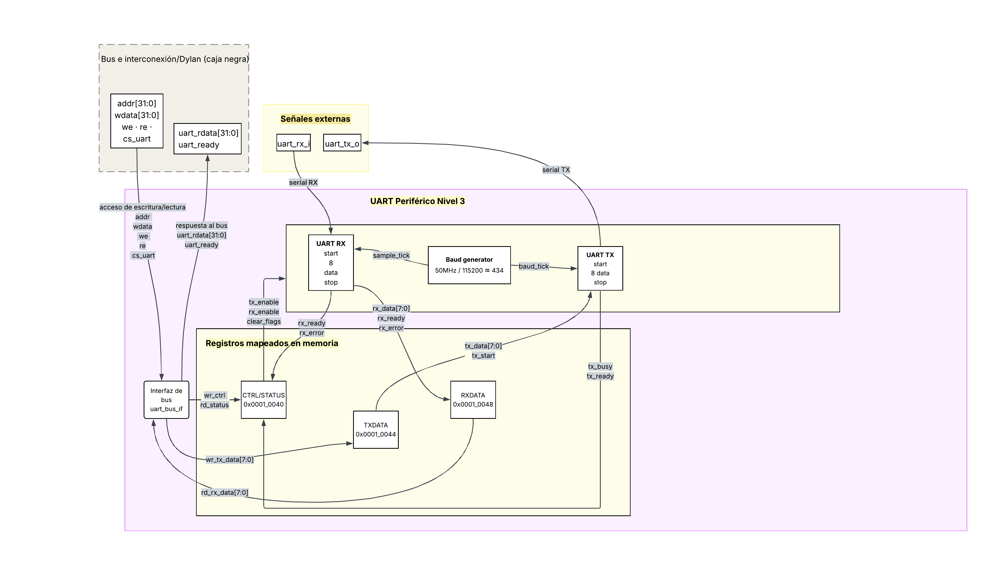
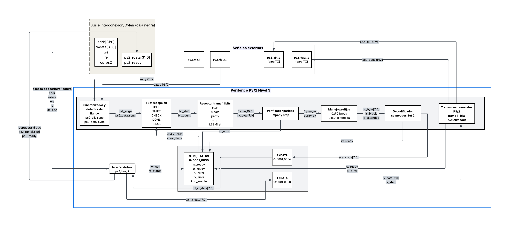

# DISENO.md — Microcontrolador RISC-V RV32I con Procesador de Texto

**Curso:** CE 3201 Taller de Diseño Digital — I Semestre 2026  
**Proyecto:** Microcontrolador RISC-V con procesador de texto  
**Equipo:** <!-- Nombres de los integrantes -->  
**Fecha:** <!-- Fecha de última actualización -->  
**Repositorio:** <!-- URL del repositorio GitLab -->

> Este documento debe completarse **antes de escribir cualquier línea de código HDL**.  
> Consulta `docs/guia_visual.md` para convenciones de diagramación y `docs/img/README.md` para nombres de archivos de imagen.

---

## 1. Metodología de diseño top-down

### 1.1 Descripción de la jerarquía de módulos

<!-- Explica brevemente cómo se aplicó el diseño modular top-down al sistema.
     Describe los niveles de jerarquía (nivel 1 → nivel 4) y por qué se eligió esa descomposición. -->

### 1.2 Criterios de descomposición modular

<!-- Describe los criterios usados para dividir el sistema en módulos:
     - Separación de responsabilidades (CPU, memoria, periféricos)
     - Independencia de interfaces
     - Reutilización y verificabilidad independiente
     - Coherencia con el mapa de memoria -->

---

## 2. Sistema completo integrado

### 2.1 Diagrama de nivel 1 — Vista de caja negra

<!-- Inserta la imagen: docs/img/nivel1_sistema.png -->

**Objetivo:** <!-- Qué resuelve el sistema completo -->

**Entradas:**

| Señal | Ancho | Función |
|-------|-------|---------|
| `clk_i` | 1 bit | Reloj principal del sistema (50 MHz) |
| `rst_i` | 1 bit | Reset activo en bajo |
| `uart_rx_i` | 1 bit | Línea de recepción UART desde PC |
| `ps2_clk_i` | 1 bit | Reloj del protocolo PS/2 |
| `ps2_data_i` | 1 bit | Datos del protocolo PS/2 |

**Salidas:**

| Señal | Ancho | Función |
|-------|-------|---------|
| `uart_tx_o` | 1 bit | Línea de transmisión UART hacia PC |
| `vga_hsync_o` | 1 bit | Sincronía horizontal VGA |
| `vga_vsync_o` | 1 bit | Sincronía vertical VGA |
| `vga_r_o` | 4 bits | Canal rojo VGA (paleta CGA) |
| `vga_g_o` | 4 bits | Canal verde VGA (paleta CGA) |
| `vga_b_o` | 4 bits | Canal azul VGA (paleta CGA) |

**Explicación general:**  
<!-- Describe en 2–3 oraciones qué hace el sistema completo desde la perspectiva del usuario -->

---

### 2.2 Diagrama de nivel 2 — Subsistemas internos

<!-- Inserta la imagen: docs/img/nivel2_sistema.png -->

**Explicación general del sistema:**  
<!-- Describe cómo interactúan los subsistemas entre sí -->

#### 2.2.1 CPU (RISC-V RV32I)

**Objetivo:**  
**Entradas:**  
**Salidas:**  
**Explicación general:**  

#### 2.2.2 Memoria ROM

**Objetivo:**  
**Entradas:**  
**Salidas:**  
**Explicación general:**  

#### 2.2.3 Memoria RAM

**Objetivo:**  
**Entradas:**  
**Salidas:**  
**Explicación general:**  

#### 2.2.4 UART

**Objetivo:**  
**Entradas:**  
**Salidas:**  
**Explicación general:**  

#### 2.2.5 PS/2

**Objetivo:**  
**Entradas:**  
**Salidas:**  
**Explicación general:**  

#### 2.2.6 Timer

**Objetivo:**  
**Entradas:**  
**Salidas:**  
**Explicación general:**  

#### 2.2.7 Controlador VGA

**Objetivo:**  
**Entradas:**  
**Salidas:**  
**Explicación general:**  

---

### 2.3 Mapa de conexiones CPU – memorias – periféricos

<!-- Inserta la imagen: docs/img/mapa_conexiones.png -->

<!-- Describe brevemente los buses principales: bus de instrucciones, bus de datos y bus de periféricos -->

---

### 2.4 Mapa de memoria

| Región | Inicio | Fin | Tamaño | Descripción |
|--------|--------|-----|--------|-------------|
| ROM (programa) | `0x0000_0000` | `0x0000_1FFF` | 8 KB | Almacena el firmware en ensamblador RV32I. Vector de reset en `0x0000_0000`. |
| RAM (datos) | `0x0000_2000` | `0x0000_2FFF` | 4 KB | Memoria de datos de lectura/escritura |
| Espacio de periféricos | `0x0001_0000` | `0x0001_FFFF` | 64 KB | Registros de control/estado/datos de periféricos |

#### Registros de periféricos

| Periférico | Registro | Offset | Dirección absoluta |
|-----------|----------|--------|--------------------|
| UART | Control/Estado | `0x00` | `0x0001_0040` |
| UART | Datos TX | `0x04` | `0x0001_0044` |
| UART | Datos RX | `0x08` | `0x0001_0048` |
| PS/2 | Control/Estado | `0x00` | `0x0001_0050` |
| PS/2 | RX | `0x04` | `0x0001_0054` |
| PS/2 | TX | `0x08` | `0x0001_0058` |
| Timer | Control/Estado | `0x00` | `0x0001_0060` |
| Timer | Datos | `0x04` | `0x0001_0064` |
| VGA | Control/Cursor | `0x00` | `0x0001_0120` |
| VGA | Buffer de texto (80×24) | — | `0x0001_1000` – `0x0001_2DFF` |

---

### 2.5 Diagrama de nivel 3 del sistema — Integración con decodificador

<!-- Inserta la imagen: docs/img/nivel3_sistema.png -->

<!-- Describe el decodificador de direcciones, las señales de chip select (CS) por módulo
     y la generación del reloj de 25 MHz para VGA -->

---

## 3. CPU RISC-V RV32I

### 3.1 Diagrama de bloques — Nivel 3

<!-- Inserta la imagen: docs/img/cpu_nivel3.png -->

<!-- Describe los bloques funcionales: PC, banco de registros, unidad de instrucción/decodificación,
     ALU, unidad de control, extensión de signo, MUXes de selección -->

### 3.2 Ruta de datos (datapath)

<!-- Inserta la imagen: docs/img/cpu_datapath.png -->

<!-- Describe el flujo de señales para al menos 3 tipos de instrucción: tipo-R, load/store, branch -->

### 3.3 FSM de la unidad de control

<!-- Inserta la imagen: docs/img/cpu_control_fsm.png -->

<!-- Describe los estados, condiciones de transición y señales de control emitidas en cada estado -->

### 3.4 Tabla de señales de control por tipo de instrucción

| Instrucción | Tipo | RegWrite | MemRead | MemWrite | Branch | ALUSrc | ALUOp |
|-------------|------|----------|---------|----------|--------|--------|-------|
| `add` | R | 1 | 0 | 0 | 0 | 0 | <!-- --> |
| `addi` | I | <!-- --> | <!-- --> | <!-- --> | <!-- --> | <!-- --> | <!-- --> |
| `lw` | I | <!-- --> | <!-- --> | <!-- --> | <!-- --> | <!-- --> | <!-- --> |
| `sw` | S | <!-- --> | <!-- --> | <!-- --> | <!-- --> | <!-- --> | <!-- --> |
| `beq` | B | <!-- --> | <!-- --> | <!-- --> | <!-- --> | <!-- --> | <!-- --> |
| `jal` | J | <!-- --> | <!-- --> | <!-- --> | <!-- --> | <!-- --> | <!-- --> |

### 3.5 Tabla de instrucciones RV32I implementadas

| Mnemónico | Tipo | opcode [6:0] | funct3 [2:0] | funct7 [6:0] | Descripción |
|-----------|------|-------------|-------------|-------------|-------------|
| `lw` | I | `0000011` | `010` | — | Carga palabra desde memoria |
| `sw` | S | `0100011` | `010` | — | Almacena palabra en memoria |
| `add` | R | `0110011` | `000` | `0000000` | Suma de registros |
| `sub` | R | `0110011` | `000` | `0100000` | Resta de registros |
| `and` | R | `0110011` | `111` | `0000000` | AND lógico |
| `or` | R | `0110011` | `110` | `0000000` | OR lógico |
| `xor` | R | `0110011` | `100` | `0000000` | XOR lógico |
| `sll` | R | `0110011` | `001` | `0000000` | Desplazamiento lógico izquierda |
| `srl` | R | `0110011` | `101` | `0000000` | Desplazamiento lógico derecha |
| `sra` | R | `0110011` | `101` | `0100000` | Desplazamiento aritmético derecha |
| `slt` | R | `0110011` | `010` | `0000000` | Set if less than (signed) |
| `sltu` | R | `0110011` | `011` | `0000000` | Set if less than (unsigned) |
| `addi` | I | `0010011` | `000` | — | Suma inmediato |
| `andi` | I | `0010011` | `111` | — | AND con inmediato |
| `ori` | I | `0010011` | `110` | — | OR con inmediato |
| `xori` | I | `0010011` | `100` | — | XOR con inmediato |
| `slli` | I | `0010011` | `001` | `0000000` | Desplazamiento lógico izq. inmediato |
| `srli` | I | `0010011` | `101` | `0000000` | Desplazamiento lógico der. inmediato |
| `srai` | I | `0010011` | `101` | `0100000` | Desplazamiento aritmético der. inmediato |
| `slti` | I | `0010011` | `010` | — | Set if less than inmediato (signed) |
| `sltui` | I | `0010011` | `011` | — | Set if less than inmediato (unsigned) |
| `beq` | B | `1100011` | `000` | — | Branch if equal |
| `bne` | B | `1100011` | `001` | — | Branch if not equal |
| `blt` | B | `1100011` | `100` | — | Branch if less than |
| `bge` | B | `1100011` | `101` | — | Branch if greater or equal |
| `jal` | J | `1101111` | — | — | Jump and link |
| `jalr` | I | `1100111` | `000` | — | Jump and link register |

### 3.6 Nivel 4 — Fichas de módulos del CPU

#### 3.6.1 Contador de Programa (PC)

**Nombre:** `program_counter`  
**Objetivo:**  
**Entradas:**  
**Salidas:**  
**Relación con otros módulos:**  
**Funcionamiento:**  
**Justificación de diseño:**  

#### 3.6.2 Banco de Registros

**Nombre:** `register_file`  
**Objetivo:**  
**Entradas:**  
**Salidas:**  
**Relación con otros módulos:**  
**Funcionamiento:**  
**Justificación de diseño:**  

#### 3.6.3 Unidad Aritmético-Lógica (ALU)

**Nombre:** `alu`  
**Objetivo:**  
**Entradas:**  
**Salidas:**  
**Relación con otros módulos:**  
**Funcionamiento:**  
**Justificación de diseño:**  

#### 3.6.4 Unidad de Control

**Nombre:** `control_unit`  
**Objetivo:**  
**Entradas:**  
**Salidas:**  
**Relación con otros módulos:**  
**Funcionamiento:**  
**Justificación de diseño:**  

#### 3.6.5 Extensión de Signo

**Nombre:** `sign_extend`  
**Objetivo:**  
**Entradas:**  
**Salidas:**  
**Relación con otros módulos:**  
**Funcionamiento:**  
**Justificación de diseño:**  

---

## 4. Periférico UART

### 4.1 Diagrama de bloques — Nivel 3

**Figura 4.1.** Diagrama de nivel 3 del periférico UART 115200-8N1.

El periférico UART se descompone en tres bloques principales: la interfaz de bus `uart_bus_if`,
el banco de registros mapeados en memoria y el núcleo UART 115200-8N1. Esta división permite
separar la comunicación con el bus del sistema, el almacenamiento de datos y control visible por
software, y la lógica serial encargada de transmitir y recibir tramas UART.

El módulo `uart_bus_if` recibe los accesos provenientes del bus de interconexión mediante las
señales `addr[31:0]`, `wdata[31:0]`, `we`, `re` y `cs_uart`. A partir de estas señales genera
operaciones internas de lectura y escritura sobre los registros UART y, cuando el procesador lee
el periférico, responde hacia el bus con `uart_rdata[31:0]` y `uart_ready`.

Los registros mapeados en memoria son `CTRL/STATUS` en `0x0001_0040`, `TXDATA` en
`0x0001_0044` y `RXDATA` en `0x0001_0048`. El registro `CTRL/STATUS` concentra las señales
de habilitación, control y estado del periférico. `TXDATA` almacena el byte que será transmitido
por el bloque `UART TX`; la escritura en este registro genera internamente la señal `tx_start`.
`RXDATA` almacena el byte entregado por el bloque `UART RX`; su lectura limpia la bandera
`rx_ready`.

El núcleo UART implementa la comunicación serial con configuración 115200-8N1: 115200 baudios,
8 bits de datos, sin paridad y 1 bit de parada. Se divide en tres submódulos: `Baud generator`,
`UART TX` y `UART RX`. El `Baud generator` deriva los pulsos de temporización a partir del
reloj de sistema de 50 MHz usando un divisor de ⌊50 000 000 / 115 200⌋ = 434 ciclos por bit.
Genera `baud_tick` para el transmisor y `sample_tick` para el receptor (muestreo en el centro
del bit). El bloque `UART TX` toma `tx_data[7:0]` y `tx_start`, construye la trama serial
(start, 8 bits LSB-first, stop) y entrega la línea externa `uart_tx_o`. El bloque `UART RX`
recibe la línea externa `uart_rx_i`, reconstruye el byte y entrega `rx_data[7:0]`, `rx_ready` y
`rx_error` al banco de registros.

**Submódulos representados en el nivel 3:**

| Bloque | Nombre RTL | Función |
|--------|------------|---------|
| Interfaz de bus | `uart_bus_if` | Traduce accesos del bus del sistema en operaciones de lectura/escritura sobre los registros UART. Genera `uart_rdata[31:0]` y `uart_ready` hacia el bus. |
| Registro de control y estado | `CTRL/STATUS` `0x0001_0040` | Almacena y expone las banderas `rx_ready`, `rx_error`, `tx_busy`, `tx_ready` y las habilitaciones `tx_enable`, `rx_enable`, `clear_flags`. |
| Registro de transmisión | `TXDATA` `0x0001_0044` | Almacena el byte a transmitir. La escritura desde el bus genera internamente `tx_start` hacia el transmisor. |
| Registro de recepción | `RXDATA` `0x0001_0048` | Almacena el último byte recibido. La lectura desde el bus limpia la bandera `rx_ready` en `CTRL/STATUS`. |
| Generador de baud rate | `baud_gen` | Genera `baud_tick` (1 pulso cada 434 ciclos) y `sample_tick` (muestreo en el centro del bit) a partir del reloj de 50 MHz. |
| Transmisor UART | `uart_tx` | Serializa el byte de `tx_data[7:0]` en la trama 8N1 y lo envía por `uart_tx_o`. Reporta `tx_busy` y `tx_ready` al banco de registros. |
| Receptor UART | `uart_rx` | Detecta el bit de inicio, muestrea los 8 bits de datos y el bit de parada en `uart_rx_i`. Entrega `rx_data[7:0]`, `rx_ready` y `rx_error`. |

**Conexiones principales del nivel 3:**

| Origen | Destino | Señales |
|--------|---------|---------|
| Bus e interconexión | `uart_bus_if` | `addr[31:0]`, `wdata[31:0]`, `we`, `re`, `cs_uart` |
| `uart_bus_if` | Bus e interconexión | `uart_rdata[31:0]`, `uart_ready` |
| `uart_bus_if` | `CTRL/STATUS` | `wr_ctrl`, `rd_status` |
| `uart_bus_if` | `TXDATA` | `wr_tx_data[7:0]` |
| `RXDATA` | `uart_bus_if` | `rd_rx_data[7:0]` |
| `CTRL/STATUS` | Núcleo UART | `tx_enable`, `rx_enable`, `clear_flags` |
| `TXDATA` | `uart_tx` | `tx_data[7:0]`, `tx_start` |
| `uart_rx` | `RXDATA` | `rx_data[7:0]` |
| `uart_rx` | `CTRL/STATUS` | `rx_ready`, `rx_error` |
| `uart_tx` | `CTRL/STATUS` | `tx_busy`, `tx_ready` |
| `baud_gen` | `uart_tx` | `baud_tick` |
| `baud_gen` | `uart_rx` | `sample_tick` |
| Señal externa | `uart_rx` | `uart_rx_i` (serial RX) |
| `uart_tx` | Señal externa | `uart_tx_o` (serial TX) |

---

### 4.2 FSM del transmisor y receptor UART

#### FSM del transmisor (`uart_tx`)

El transmisor implementa una FSM de 4 estados. Al recibir `tx_start`, carga el byte en un
registro de desplazamiento y serializa los bits a la tasa de `baud_tick`.

| Estado | Condición de salida | Próximo estado | Señales activas |
|--------|--------------------|--------------  |-----------------|
| `IDLE` | `tx_start = 1` | `START` | `tx_ready = 1`, `uart_tx_o = 1` |
| `START` | `baud_tick = 1` | `DATA` | `uart_tx_o = 0` (bit de inicio), `tx_busy = 1` |
| `DATA` | `baud_tick = 1` y `bit_count < 8` | `DATA` | `uart_tx_o = tx_shift[0]`, desplazamiento derecha |
| `DATA` | `baud_tick = 1` y `bit_count = 8` | `STOP` | último bit enviado |
| `STOP` | `baud_tick = 1` | `IDLE` | `uart_tx_o = 1` (bit de parada), `tx_ready = 1` |

#### FSM del receptor (`uart_rx`)

El receptor muestrea la línea `uart_rx_i` con `sample_tick` (centro del bit) para reconstruir
el byte recibido.

| Estado | Condición de salida | Próximo estado | Señales activas |
|--------|--------------------|--------------  |-----------------|
| `IDLE` | flanco descendente en `uart_rx_i` | `START` | en espera |
| `START` | `sample_tick = 1` (centro del bit de inicio) | `DATA` | verifica que `uart_rx_i = 0`; si no, vuelve a `IDLE` |
| `DATA` | `sample_tick = 1` y `bit_count < 8` | `DATA` | captura bit en `rx_shift`, incrementa `bit_count` |
| `DATA` | `sample_tick = 1` y `bit_count = 8` | `STOP` | byte completo en `rx_shift` |
| `STOP` | `sample_tick = 1` y `uart_rx_i = 1` | `IDLE` | `rx_ready = 1`, `rx_data = rx_shift` |
| `STOP` | `sample_tick = 1` y `uart_rx_i = 0` | `IDLE` | `rx_error = 1` (error de enmarcado) |

---

### 4.3 Tabla de interfaz de puertos

La siguiente tabla describe la interfaz del periférico UART completo tal como es vista desde el
bus de interconexión y desde las señales externas de la FPGA.

| Puerto | Dirección | Ancho | Función |
|--------|-----------|-------|---------|
| `clk_i` | Entrada | 1 bit | Reloj del sistema (50 MHz) |
| `rst_i` | Entrada | 1 bit | Reset activo en bajo |
| `addr_i` | Entrada | 32 bits | Dirección del registro accedido en el espacio de periféricos |
| `wdata_i` | Entrada | 32 bits | Dato de escritura desde el bus |
| `we_i` | Entrada | 1 bit | Habilitación de escritura |
| `re_i` | Entrada | 1 bit | Habilitación de lectura |
| `cs_uart_i` | Entrada | 1 bit | Chip select: selecciona este periférico |
| `rdata_o` | Salida | 32 bits | Dato de lectura hacia el bus |
| `ready_o` | Salida | 1 bit | Indica que la respuesta del periférico es válida |
| `uart_rx_i` | Entrada | 1 bit | Línea serial de recepción desde la PC |
| `uart_tx_o` | Salida | 1 bit | Línea serial de transmisión hacia la PC |

---

### 4.4 Nivel 4 — Fichas de módulos del UART

#### 4.4.1 Interfaz de bus UART

**Nombre:** `uart_bus_if`

**Objetivo:** Traducir los accesos de lectura y escritura provenientes del bus del sistema en
operaciones internas sobre los registros `CTRL/STATUS`, `TXDATA` y `RXDATA`, y generar la
respuesta `uart_rdata[31:0]` y `uart_ready` hacia el bus.

**Entradas:**

| Puerto | Ancho | Función |
|--------|-------|---------|
| `clk_i` | 1 bit | Reloj del sistema |
| `rst_i` | 1 bit | Reset activo en bajo |
| `addr_i` | 32 bits | Dirección del registro accedido |
| `wdata_i` | 32 bits | Dato de escritura desde el bus |
| `we_i` | 1 bit | Habilitación de escritura |
| `re_i` | 1 bit | Habilitación de lectura |
| `cs_uart_i` | 1 bit | Chip select |
| `status_i` | 32 bits | Valor actual del registro `CTRL/STATUS` para lectura |
| `rx_data_i` | 8 bits | Byte disponible en `RXDATA` para lectura |

**Salidas:**

| Puerto | Ancho | Función |
|--------|-------|---------|
| `rdata_o` | 32 bits | Dato leído, multiplexado según la dirección |
| `ready_o` | 1 bit | Respuesta válida al bus |
| `wr_ctrl_o` | 1 bit | Pulso de escritura hacia `CTRL/STATUS` |
| `rd_status_o` | 1 bit | Pulso de lectura de `CTRL/STATUS` |
| `wr_tx_data_o` | 8 bits | Byte a escribir en `TXDATA` |
| `rd_rx_data_o` | 1 bit | Pulso de lectura de `RXDATA` (limpia `rx_ready`) |

**Relación con otros módulos:** Conecta el bus de interconexión con el banco de registros del
periférico. Es el único punto de entrada y salida de datos entre el CPU y el UART.

**Funcionamiento:** Cuando `cs_uart_i = 1` y `we_i = 1`, decodifica `addr_i` para determinar
el registro destino y genera el pulso de escritura correspondiente. Cuando `cs_uart_i = 1` y
`re_i = 1`, selecciona el dato del registro correspondiente y lo coloca en `rdata_o`. La señal
`ready_o` se activa en el ciclo siguiente al acceso.

**Justificación de diseño:** Centralizar la lógica de decodificación de direcciones en un único
módulo de interfaz simplifica los registros internos y facilita la verificación independiente de
la lógica de bus frente a la lógica serial.

---

#### 4.4.2 Generador de baud rate

**Nombre:** `baud_gen`

**Objetivo:** Generar los pulsos de temporización `baud_tick` y `sample_tick` a partir del reloj
de sistema de 50 MHz para sincronizar la transmisión y la recepción a 115 200 baudios.

**Entradas:**

| Puerto | Ancho | Función |
|--------|-------|---------|
| `clk_i` | 1 bit | Reloj del sistema (50 MHz) |
| `rst_i` | 1 bit | Reset activo en bajo |

**Salidas:**

| Puerto | Ancho | Función |
|--------|-------|---------|
| `baud_tick_o` | 1 bit | Pulso de 1 ciclo cada 434 ciclos de reloj; cadencia de un bit UART |
| `sample_tick_o` | 1 bit | Pulso en el centro del intervalo de bit (≈ 217 ciclos tras el flanco de inicio) |

**Relación con otros módulos:** `baud_tick_o` se conecta a `uart_tx` para controlar el avance
de la FSM de transmisión. `sample_tick_o` se conecta a `uart_rx` para el muestreo en el centro
del bit recibido.

**Funcionamiento:** Implementa un contador descendente de 9 bits inicializado en 433 (divisor =
⌊50 000 000 / 115 200⌋ = 434). Cuando el contador llega a 0, emite `baud_tick_o` por 1 ciclo y
se recarga. El `sample_tick_o` se genera cuando el mismo contador alcanza 216 (mitad del período).

**Justificación de diseño:** Separar la generación de temporización en un módulo independiente
permite que TX y RX compartan el mismo divisor sin duplicar lógica, y facilita ajustar la tasa
de baudios cambiando un único parámetro.

---

#### 4.4.3 Transmisor UART

**Nombre:** `uart_tx`

**Objetivo:** Serializar un byte de 8 bits en una trama UART 8N1 (start + 8 datos LSB-first +
stop) y enviarlo por la línea `uart_tx_o` a la tasa dictada por `baud_tick_i`.

**Entradas:**

| Puerto | Ancho | Función |
|--------|-------|---------|
| `clk_i` | 1 bit | Reloj del sistema |
| `rst_i` | 1 bit | Reset activo en bajo |
| `tx_data_i` | 8 bits | Byte a transmitir |
| `tx_start_i` | 1 bit | Inicia la transmisión (generado por escritura en `TXDATA`) |
| `baud_tick_i` | 1 bit | Pulso de cadencia de bit desde `baud_gen` |

**Salidas:**

| Puerto | Ancho | Función |
|--------|-------|---------|
| `uart_tx_o` | 1 bit | Línea serial de salida |
| `tx_busy_o` | 1 bit | Activo mientras se transmite una trama |
| `tx_ready_o` | 1 bit | Activo cuando el transmisor está libre para aceptar un nuevo byte |

**Relación con otros módulos:** Recibe datos de `TXDATA` a través de `tx_data_i` y `tx_start_i`.
Reporta estado a `CTRL/STATUS` mediante `tx_busy_o` y `tx_ready_o`. Usa el `baud_tick_i` de
`baud_gen`.

**Funcionamiento:** Implementa la FSM de 4 estados `IDLE → START → DATA → STOP` descrita en
la sección 4.2. En `IDLE`, mantiene `uart_tx_o = 1` (línea en reposo). Al recibir `tx_start_i`,
carga `tx_data_i` en un registro de desplazamiento de 8 bits y avanza los estados con cada
`baud_tick_i`. En `DATA`, desplaza el registro a la derecha y coloca el bit LSB en `uart_tx_o`.
Al completar los 8 bits, envía el bit de parada (`uart_tx_o = 1`) durante un período de baud y
regresa a `IDLE`.

**Justificación de diseño:** La serialización LSB-first con un registro de desplazamiento es la
implementación más directa del estándar UART y minimiza la lógica combinacional en el camino
crítico de la línea serial.

---

#### 4.4.4 Receptor UART

**Nombre:** `uart_rx`

**Objetivo:** Detectar el bit de inicio en la línea `uart_rx_i`, muestrear los 8 bits de datos
en el centro de cada período de bit usando `sample_tick_i`, verificar el bit de parada y entregar
el byte reconstruido junto con las señales de estado.

**Entradas:**

| Puerto | Ancho | Función |
|--------|-------|---------|
| `clk_i` | 1 bit | Reloj del sistema |
| `rst_i` | 1 bit | Reset activo en bajo |
| `uart_rx_i` | 1 bit | Línea serial de entrada |
| `sample_tick_i` | 1 bit | Pulso de muestreo en el centro del bit desde `baud_gen` |
| `rx_enable_i` | 1 bit | Habilita la recepción (desde `CTRL/STATUS`) |
| `clear_flags_i` | 1 bit | Limpia `rx_ready` y `rx_error` (desde `CTRL/STATUS`) |

**Salidas:**

| Puerto | Ancho | Función |
|--------|-------|---------|
| `rx_data_o` | 8 bits | Byte recibido y reconstruido |
| `rx_ready_o` | 1 bit | Se activa al completar la recepción de una trama válida |
| `rx_error_o` | 1 bit | Se activa si el bit de parada no es `1` (error de enmarcado) |

**Relación con otros módulos:** Entrega `rx_data_o` al registro `RXDATA`. Reporta `rx_ready_o`
y `rx_error_o` a `CTRL/STATUS`. Consume `sample_tick_i` de `baud_gen`.

**Funcionamiento:** Implementa la FSM de 5 estados `IDLE → START → DATA → STOP → IDLE`
descrita en la sección 4.2. La detección del bit de inicio se realiza por flanco descendente en
`uart_rx_i`. En el estado `START`, `sample_tick_i` verifica que la línea sigue en bajo en el
centro del bit de inicio, confirmando que no fue un glitch. En `DATA`, captura 8 bits LSB-first
en un registro de desplazamiento con cada `sample_tick_i`. En `STOP`, verifica que `uart_rx_i = 1`;
si no lo está, activa `rx_error_o`.

**Justificación de diseño:** El muestreo en el centro del período de bit maximiza el margen de
ruido y es la técnica estándar para receptores UART asíncronos. Separar el receptor del transmisor
en módulos independientes permite verificarlos individualmente con testbenches simples.

---

## 5. Periférico PS/2

### 5.1 Diagrama de bloques — Nivel 3

**Figura 5.1.** Diagrama de nivel 3 del periférico PS/2 con receptor de tramas de 11 bits,
manejo de prefijos y transmisor de comandos.

El periférico PS/2 se descompone en cuatro bloques principales: la interfaz de bus `ps2_bus_if`,
el banco de registros mapeados en memoria, la cadena de recepción y el transmisor de comandos.
Esta organización separa la lógica de bus del protocolo físico PS/2 y permite verificar cada
bloque de forma independiente.

El módulo `ps2_bus_if` recibe los accesos del bus de interconexión mediante `addr[31:0]`,
`wdata[31:0]`, `we`, `re` y `cs_ps2`. Genera operaciones internas de lectura y escritura sobre
los registros PS/2 y responde al bus con `ps2_rdata[31:0]` y `ps2_ready`.

Los registros mapeados en memoria son `CTRL/STATUS` en `0x0001_0050`, `RXDATA` en
`0x0001_0054` y `TXDATA` en `0x0001_0058`. El registro `CTRL/STATUS` expone las banderas de
estado visibles por software: `rx_ready` (bit 0), `tx_ready` (bit 1), `rx_error` (bit 2),
`tx_error` (bit 3) y el control `kbd_enable` (bit 4). `RXDATA` almacena el scancode entregado
por el decodificador; su lectura limpia `rx_ready`. `TXDATA` almacena el comando a enviar al
teclado; la escritura genera internamente `tx_start` hacia el transmisor.

La cadena de recepción opera en la frontera del protocolo PS/2. Las señales externas `ps2_clk_i`
y `ps2_data_i` ingresan primero al sincronizador y detector de flanco, que las sincroniza al
reloj del sistema y detecta el flanco descendente de `ps2_clk_i`. La FSM de recepción avanza en
cada flanco descendente detectado, controlando el receptor de trama de 11 bits mediante `bit_shift`
y `bit_count`. El receptor captura la trama completa: bit de inicio, 8 bits de datos LSB-first,
bit de paridad impar y bit de parada. El verificador de paridad y stop valida la trama; si es
correcta, entrega `frame_ok` y `parity_ok` al módulo de manejo de prefijos. Si hay error, activa
`rx_error` hacia `CTRL/STATUS`. El módulo de manejo de prefijos detecta los bytes `0xF0`
(break code) y `0xE0` (tecla extendida) y genera las señales internas `is_break` e
`is_extended`, que son consumidas exclusivamente por el decodificador de scancodes Set 2.
Estas señales no son visibles en los registros del periférico. El decodificador produce el
`scancode[7:0]` final y activa `rx_ready` cuando el dato es válido.

El transmisor de comandos PS/2 toma `tx_data[7:0]` y `tx_start` desde `TXDATA`, genera la
trama de 11 bits correspondiente y controla las líneas externas `ps2_clk_o` y `ps2_data_o`.
Reporta `tx_ready` y `tx_error` hacia `CTRL/STATUS`.

**Submódulos representados en el nivel 3:**

| Bloque | Nombre RTL | Función |
|--------|------------|---------|
| Interfaz de bus | `ps2_bus_if` | Traduce accesos del bus en operaciones de lectura/escritura sobre los registros PS/2. Genera `ps2_rdata[31:0]` y `ps2_ready`. |
| Registro de control y estado | `CTRL/STATUS` `0x0001_0050` | Expone `rx_ready`, `tx_ready`, `rx_error`, `tx_error` y `kbd_enable` al software. |
| Registro de recepción | `RXDATA` `0x0001_0054` | Almacena el scancode final. Su lectura limpia `rx_ready`. |
| Registro de transmisión | `TXDATA` `0x0001_0058` | Almacena el comando a enviar. La escritura genera `tx_start` internamente. |
| Sincronizador y detector de flanco | `ps2_sync` | Sincroniza `ps2_clk_i` y `ps2_data_i` al dominio del reloj del sistema y detecta el flanco descendente de `ps2_clk_i`. |
| FSM de recepción | `ps2_rx_fsm` | Controla la captura de bits mediante los estados `IDLE`, `SHIFT`, `CHECK`, `DONE` y `ERROR`. |
| Receptor de trama de 11 bits | `ps2_rx_frame` | Captura los 11 bits del protocolo PS/2 (start, 8 datos LSB-first, paridad, stop) en cada flanco detectado. |
| Verificador de paridad y stop | `ps2_parity_chk` | Verifica paridad impar y que el bit de parada sea `1`. Genera `frame_ok`, `parity_ok` y `rx_error`. |
| Manejo de prefijos | `ps2_prefix` | Detecta los bytes `0xF0` y `0xE0`. Genera las señales internas `is_break` e `is_extended` hacia el decodificador. |
| Decodificador de scancodes Set 2 | `ps2_decoder` | Consume `rx_byte[7:0]`, `is_break` e `is_extended` para producir `scancode[7:0]` y activar `rx_ready`. |
| Transmisor de comandos PS/2 | `ps2_tx` | Genera la trama PS/2 de 11 bits para enviar comandos al teclado. Controla `ps2_clk_o` y `ps2_data_o`. Reporta `tx_ready` y `tx_error`. |

**Conexiones principales del nivel 3:**

| Origen | Destino | Señales |
|--------|---------|---------|
| Bus e interconexión | `ps2_bus_if` | `addr[31:0]`, `wdata[31:0]`, `we`, `re`, `cs_ps2` |
| `ps2_bus_if` | Bus e interconexión | `ps2_rdata[31:0]`, `ps2_ready` |
| `ps2_bus_if` | `CTRL/STATUS` | `wr_ctrl`, `rd_status` |
| `ps2_bus_if` | `TXDATA` | `wr_tx_data[7:0]` |
| `RXDATA` | `ps2_bus_if` | `rd_rx_data[7:0]` |
| `CTRL/STATUS` | `ps2_rx_fsm` | `kbd_enable`, `clear_flags` |
| Señal externa | `ps2_sync` | `ps2_clk_i`, `ps2_data_i` |
| `ps2_sync` | `ps2_rx_fsm` | `fall_edge`, `ps2_data_sync` |
| `ps2_rx_fsm` | `ps2_rx_frame` | `bit_shift`, `bit_count` |
| `ps2_rx_frame` | `ps2_parity_chk` | `frame[10:0]`, `rx_byte[7:0]` |
| `ps2_parity_chk` | `ps2_prefix` | `frame_ok`, `parity_ok`, `rx_byte[7:0]` |
| `ps2_parity_chk` | `CTRL/STATUS` | `rx_error` |
| `ps2_prefix` | `ps2_decoder` | `rx_byte[7:0]`, `is_break`, `is_extended` |
| `ps2_decoder` | `RXDATA` | `scancode[7:0]` |
| `ps2_decoder` | `CTRL/STATUS` | `rx_ready` |
| `TXDATA` | `ps2_tx` | `tx_data[7:0]`, `tx_start` |
| `ps2_tx` | `CTRL/STATUS` | `tx_ready`, `tx_error` |
| `ps2_tx` | Señal externa | `ps2_clk_o` (`ps2_clk_drive`) |
| `ps2_tx` | Señal externa | `ps2_data_o` (`ps2_data_drive`) |

---

### 5.2 FSM de recepción PS/2

La FSM del receptor PS/2 avanza en cada flanco descendente de `ps2_clk_i` detectado por el
sincronizador. Los estados capturan los 11 bits del protocolo en orden LSB-first y verifican la
validez de la trama al final.

| Estado | Descripción | Condición de salida | Próximo estado | Señales activas |
|--------|-------------|---------------------|----------------|-----------------|
| `IDLE` | Espera el flanco descendente que indica el bit de inicio | `fall_edge = 1` y `ps2_data_sync = 0` | `SHIFT` | `bit_count = 0` |
| `IDLE` | Flanco detectado pero línea de datos no está en bajo | `fall_edge = 1` y `ps2_data_sync = 1` | `IDLE` | descarta el flanco (glitch) |
| `SHIFT` | Captura 8 bits de datos y el bit de paridad (9 flancos en total) | `fall_edge = 1` y `bit_count < 9` | `SHIFT` | `bit_shift = 1`, incrementa `bit_count` |
| `SHIFT` | Se completó la captura del noveno bit (paridad) | `fall_edge = 1` y `bit_count = 9` | `CHECK` | `bit_shift = 1` |
| `CHECK` | Evalúa el bit de parada: debe ser `1` | `ps2_data_sync = 1` | `DONE` | `frame_ok` si paridad válida |
| `CHECK` | Bit de parada incorrecto | `ps2_data_sync = 0` | `ERROR` | `rx_error = 1` |
| `DONE` | Trama válida recibida; se entrega a la cadena de decodificación | siempre | `IDLE` | `rx_ready` (vía decodificador) |
| `ERROR` | Error de enmarcado o paridad; se descarta la trama | siempre | `IDLE` | `rx_error = 1` hacia `CTRL/STATUS` |

#### Manejo de prefijos `0xF0` y `0xE0`

Cuando el decodificador recibe el byte `0xF0`, activa internamente `is_break` y espera el
siguiente scancode para producir el código de liberación de tecla. Cuando recibe `0xE0`, activa
`is_extended` y espera el siguiente byte para producir el scancode de una tecla extendida. Ambas
señales son internas al bloque `ps2_prefix` → `ps2_decoder` y no se exponen en `CTRL/STATUS`
ni en `RXDATA` de forma independiente: el software solo lee el scancode final resultante.

---

### 5.3 Tabla de interfaz de puertos

La siguiente tabla describe la interfaz del periférico PS/2 completo tal como es vista desde el
bus de interconexión y desde las señales físicas de la FPGA.

| Puerto | Dirección | Ancho | Función |
|--------|-----------|-------|---------|
| `clk_i` | Entrada | 1 bit | Reloj del sistema (50 MHz) |
| `rst_i` | Entrada | 1 bit | Reset activo en bajo |
| `addr_i` | Entrada | 32 bits | Dirección del registro accedido en el espacio de periféricos |
| `wdata_i` | Entrada | 32 bits | Dato de escritura desde el bus |
| `we_i` | Entrada | 1 bit | Habilitación de escritura |
| `re_i` | Entrada | 1 bit | Habilitación de lectura |
| `cs_ps2_i` | Entrada | 1 bit | Chip select: selecciona este periférico |
| `rdata_o` | Salida | 32 bits | Dato de lectura hacia el bus |
| `ready_o` | Salida | 1 bit | Indica que la respuesta del periférico es válida |
| `ps2_clk_i` | Entrada | 1 bit | Línea de reloj PS/2 desde el teclado |
| `ps2_data_i` | Entrada | 1 bit | Línea de datos PS/2 desde el teclado |
| `ps2_clk_o` | Salida | 1 bit | Línea de reloj PS/2 controlada por el MCU durante transmisión |
| `ps2_data_o` | Salida | 1 bit | Línea de datos PS/2 controlada por el MCU durante transmisión |

> **Nota de implementación:** Las líneas `ps2_clk` y `ps2_data` son bidireccionales en el
> estándar PS/2. En la FPGA se implementan como pares entrada/salida separados con lógica de
> habilitación de salida; la línea física se controla mediante un buffer triestado o asignación
> de pin bidireccional en Quartus.

---

### 5.4 Nivel 4 — Fichas de módulos del PS/2

#### 5.4.1 Interfaz de bus PS/2

**Nombre:** `ps2_bus_if`

**Objetivo:** Traducir los accesos de lectura y escritura del bus del sistema en operaciones
internas sobre los registros `CTRL/STATUS`, `RXDATA` y `TXDATA`, y generar la respuesta
`ps2_rdata[31:0]` y `ps2_ready` hacia el bus.

**Entradas:**

| Puerto | Ancho | Función |
|--------|-------|---------|
| `clk_i` | 1 bit | Reloj del sistema |
| `rst_i` | 1 bit | Reset activo en bajo |
| `addr_i` | 32 bits | Dirección del registro accedido |
| `wdata_i` | 32 bits | Dato de escritura desde el bus |
| `we_i` | 1 bit | Habilitación de escritura |
| `re_i` | 1 bit | Habilitación de lectura |
| `cs_ps2_i` | 1 bit | Chip select |
| `status_i` | 32 bits | Valor actual de `CTRL/STATUS` para lectura |
| `rx_data_i` | 8 bits | Scancode disponible en `RXDATA` para lectura |

**Salidas:**

| Puerto | Ancho | Función |
|--------|-------|---------|
| `rdata_o` | 32 bits | Dato leído, multiplexado según la dirección |
| `ready_o` | 1 bit | Respuesta válida al bus |
| `wr_ctrl_o` | 1 bit | Pulso de escritura hacia `CTRL/STATUS` |
| `rd_status_o` | 1 bit | Pulso de lectura de `CTRL/STATUS` |
| `wr_tx_data_o` | 8 bits | Byte a escribir en `TXDATA` |
| `rd_rx_data_o` | 1 bit | Pulso de lectura de `RXDATA` (limpia `rx_ready`) |

**Relación con otros módulos:** Es el único punto de contacto entre el bus de interconexión y
los registros internos del periférico PS/2.

**Funcionamiento:** Decodifica `addr_i` comparándola con las direcciones `0x0001_0050`,
`0x0001_0054` y `0x0001_0058`. En escritura, genera el pulso al registro destino correspondiente.
En lectura, multiplexea el contenido de `CTRL/STATUS` o `RXDATA` en `rdata_o` según la
dirección. La lectura de `RXDATA` genera adicionalmente `rd_rx_data_o` para limpiar `rx_ready`.

**Justificación de diseño:** Igual que en UART, concentrar la decodificación de direcciones en
un módulo de interfaz dedicado aísla la lógica del protocolo físico PS/2 de los detalles del
bus, simplificando ambos bloques y sus testbenches.

---

#### 5.4.2 Sincronizador y detector de flanco

**Nombre:** `ps2_sync`

**Objetivo:** Sincronizar las señales asíncronas `ps2_clk_i` y `ps2_data_i` al dominio del reloj
del sistema para evitar metaestabilidad, y detectar el flanco descendente de `ps2_clk_i` que
marca la captura de cada bit.

**Entradas:**

| Puerto | Ancho | Función |
|--------|-------|---------|
| `clk_i` | 1 bit | Reloj del sistema |
| `rst_i` | 1 bit | Reset activo en bajo |
| `ps2_clk_i` | 1 bit | Línea de reloj PS/2 (asíncrona) |
| `ps2_data_i` | 1 bit | Línea de datos PS/2 (asíncrona) |

**Salidas:**

| Puerto | Ancho | Función |
|--------|-------|---------|
| `ps2_clk_sync_o` | 1 bit | Reloj PS/2 sincronizado al dominio del sistema |
| `ps2_data_sync_o` | 1 bit | Datos PS/2 sincronizados al dominio del sistema |
| `fall_edge_o` | 1 bit | Pulso de 1 ciclo que indica el flanco descendente de `ps2_clk` |

**Relación con otros módulos:** `fall_edge_o` y `ps2_data_sync_o` se conectan directamente a
la FSM de recepción `ps2_rx_fsm`.

**Funcionamiento:** Implementa un doble registro de sincronización (flip-flop de dos etapas)
para cada señal de entrada. El flanco descendente se detecta comparando el valor actual del
registro sincronizado con el del ciclo anterior: `fall_edge = clk_prev & ~clk_sync`.

**Justificación de diseño:** El teclado PS/2 opera con su propio oscilador independiente
(típicamente entre 10 kHz y 16.7 kHz). Sin sincronización, el muestreo directo de estas señales
en el dominio de 50 MHz produciría metaestabilidad. El doble registro reduce la probabilidad de
falla a niveles aceptables para síntesis en FPGA.

---

#### 5.4.3 FSM de recepción PS/2

**Nombre:** `ps2_rx_fsm`

**Objetivo:** Controlar la secuencia de captura de los 11 bits de la trama PS/2 avanzando por
los estados `IDLE`, `SHIFT`, `CHECK`, `DONE` y `ERROR` en respuesta a los flancos descendentes
detectados por el sincronizador.

**Entradas:**

| Puerto | Ancho | Función |
|--------|-------|---------|
| `clk_i` | 1 bit | Reloj del sistema |
| `rst_i` | 1 bit | Reset activo en bajo |
| `fall_edge_i` | 1 bit | Flanco descendente detectado de `ps2_clk` |
| `ps2_data_sync_i` | 1 bit | Dato sincronizado al momento del flanco |
| `kbd_enable_i` | 1 bit | Habilita la recepción (desde `CTRL/STATUS`) |
| `clear_flags_i` | 1 bit | Reinicia la FSM a `IDLE` |

**Salidas:**

| Puerto | Ancho | Función |
|--------|-------|---------|
| `bit_shift_o` | 1 bit | Pulso que ordena al receptor de trama capturar el bit actual |
| `bit_count_o` | 4 bits | Número del bit que se está capturando (0–10) |
| `frame_done_o` | 1 bit | La trama de 11 bits está completa y lista para verificación |
| `rx_error_o` | 1 bit | Error de enmarcado detectado (bit de parada incorrecto) |

**Relación con otros módulos:** Controla al receptor de trama `ps2_rx_frame`. Recibe habilitación
desde `CTRL/STATUS` y reporta `rx_error` de vuelta a `CTRL/STATUS`.

**Funcionamiento:** Descrito en la tabla de la sección 5.2. La transición `IDLE → SHIFT`
requiere que `fall_edge_i = 1` y que `ps2_data_sync_i = 0` para confirmar el bit de inicio
válido. La transición `CHECK → DONE` o `CHECK → ERROR` evalúa el bit de parada al décimo
flanco.

**Justificación de diseño:** Usar una FSM explícita en lugar de un contador monolítico permite
tratar el estado `ERROR` como un estado diferenciado, facilita la inserción de lógica de
recuperación (timeout) y hace el diseño verificable por inspección de la tabla de estados.

---

#### 5.4.4 Receptor de trama de 11 bits

**Nombre:** `ps2_rx_frame`

**Objetivo:** Capturar los 11 bits de la trama PS/2 en un registro de desplazamiento a medida
que la FSM de recepción los habilita, y entregar la trama completa al verificador.

**Entradas:**

| Puerto | Ancho | Función |
|--------|-------|---------|
| `clk_i` | 1 bit | Reloj del sistema |
| `rst_i` | 1 bit | Reset activo en bajo |
| `bit_shift_i` | 1 bit | Pulso de captura del bit actual (desde la FSM) |
| `ps2_data_sync_i` | 1 bit | Bit de dato sincronizado |

**Salidas:**

| Puerto | Ancho | Función |
|--------|-------|---------|
| `frame_o` | 11 bits | Trama completa: `{stop, parity, data[7:0], start}` |
| `rx_byte_o` | 8 bits | Extracción directa de los 8 bits de datos (`frame[8:1]`) |

**Relación con otros módulos:** Alimentado por la FSM `ps2_rx_fsm`. Su salida `rx_byte_o` y
`frame_o` se entregan al verificador `ps2_parity_chk`.

**Funcionamiento:** En cada pulso `bit_shift_i`, desplaza el registro hacia la derecha e ingresa
`ps2_data_sync_i` por el bit más significativo. Al completar los 11 flancos, el registro contiene
la trama completa en el orden en que fue recibida (LSB del byte de datos en la posición de bit 1).

**Justificación de diseño:** Un registro de desplazamiento de entrada serial es la implementación
más directa y eficiente en recursos para capturar protocolos síncronos de velocidad baja como
PS/2.

---

#### 5.4.5 Verificador de paridad y stop

**Nombre:** `ps2_parity_chk`

**Objetivo:** Verificar que la trama recibida cumpla con paridad impar sobre los 8 bits de datos
y que el bit de parada sea `1`, y generar las señales de validez o error correspondientes.

**Entradas:**

| Puerto | Ancho | Función |
|--------|-------|---------|
| `frame_i` | 11 bits | Trama completa desde el receptor de trama |
| `rx_byte_i` | 8 bits | Byte de datos extraído de la trama |
| `frame_done_i` | 1 bit | Indica que la trama está lista para verificación |

**Salidas:**

| Puerto | Ancho | Función |
|--------|-------|---------|
| `frame_ok_o` | 1 bit | La trama es válida: paridad correcta y bit de parada en `1` |
| `parity_ok_o` | 1 bit | El bit de paridad cumple la condición de paridad impar |
| `rx_error_o` | 1 bit | Error de paridad o de bit de parada |
| `rx_byte_o` | 8 bits | Byte de datos validado, entregado al módulo de prefijos |

**Relación con otros módulos:** Recibe de `ps2_rx_frame`. Entrega `frame_ok` y `rx_byte` al
módulo `ps2_prefix`. Entrega `rx_error` a `CTRL/STATUS`.

**Funcionamiento:** La paridad impar se verifica como `^(frame[8:1]) == frame[9]` (XOR de los 8
bits de datos debe ser igual al bit de paridad). El bit de parada se verifica como
`frame[10] == 1`. Si ambas condiciones se cumplen cuando `frame_done_i = 1`, se activa
`frame_ok_o`; en caso contrario se activa `rx_error_o`.

**Justificación de diseño:** Separar la verificación en un módulo dedicado permite sustituirla
o deshabilitarla independientemente sin modificar la FSM ni el receptor de trama, lo que
simplifica las pruebas de integración.

---

#### 5.4.6 Manejo de prefijos

**Nombre:** `ps2_prefix`

**Objetivo:** Detectar los bytes de prefijo `0xF0` (break code) y `0xE0` (tecla extendida) del
Set 2 de PS/2, y generar las señales internas `is_break` e `is_extended` para que el
decodificador interprete correctamente el byte siguiente.

**Entradas:**

| Puerto | Ancho | Función |
|--------|-------|---------|
| `clk_i` | 1 bit | Reloj del sistema |
| `rst_i` | 1 bit | Reset activo en bajo |
| `frame_ok_i` | 1 bit | Trama válida disponible desde el verificador |
| `rx_byte_i` | 8 bits | Byte validado desde el verificador |

**Salidas:**

| Puerto | Ancho | Función |
|--------|-------|---------|
| `rx_byte_o` | 8 bits | Byte de dato (no prefijo) hacia el decodificador |
| `is_break_o` | 1 bit | Señal interna: el byte siguiente es un código de liberación |
| `is_extended_o` | 1 bit | Señal interna: el byte siguiente corresponde a una tecla extendida |
| `data_valid_o` | 1 bit | El byte actual es un scancode real (no un prefijo) y debe decodificarse |

**Relación con otros módulos:** Recibe de `ps2_parity_chk`. Sus salidas `is_break_o`,
`is_extended_o` y `rx_byte_o` se consumen únicamente por `ps2_decoder`. Las señales `is_break`
e `is_extended` no son visibles en `CTRL/STATUS` ni en ningún registro accesible por software.

**Funcionamiento:** Mantiene dos flags internos `pending_break` y `pending_extended`. Cuando
`frame_ok_i = 1` y `rx_byte_i = 0xF0`, activa `pending_break` y no genera `data_valid_o`. Cuando
`rx_byte_i = 0xE0`, activa `pending_extended`. En cualquier otro byte, transfiere `rx_byte_i` al
decodificador con `data_valid_o = 1` junto con el estado actual de los flags, y los limpia.

**Justificación de diseño:** Encapsular el manejo de prefijos en un módulo separado del
decodificador simplifica la lógica de decodificación y hace explícito el contrato de interfaz:
el decodificador nunca ve bytes `0xF0` ni `0xE0`, solo scancodes reales acompañados de sus
metadatos de contexto.

---

#### 5.4.7 Decodificador de scancodes Set 2

**Nombre:** `ps2_decoder`

**Objetivo:** Convertir el byte de scancode Set 2 recibido junto con los metadatos `is_break` e
`is_extended` en el valor final de scancode almacenado en `RXDATA`, y activar `rx_ready` para
notificar al software.

**Entradas:**

| Puerto | Ancho | Función |
|--------|-------|---------|
| `clk_i` | 1 bit | Reloj del sistema |
| `rst_i` | 1 bit | Reset activo en bajo |
| `data_valid_i` | 1 bit | Byte de scancode disponible desde el módulo de prefijos |
| `rx_byte_i` | 8 bits | Byte de scancode (sin prefijos) |
| `is_break_i` | 1 bit | El evento es una liberación de tecla |
| `is_extended_i` | 1 bit | El scancode corresponde a una tecla extendida |
| `kbd_enable_i` | 1 bit | Habilita la entrega de scancodes al banco de registros |

**Salidas:**

| Puerto | Ancho | Función |
|--------|-------|---------|
| `scancode_o` | 8 bits | Scancode final hacia `RXDATA` |
| `rx_ready_o` | 1 bit | Scancode válido disponible para lectura por el software |

**Relación con otros módulos:** Recibe de `ps2_prefix`. Entrega `scancode_o` a `RXDATA` y
`rx_ready_o` a `CTRL/STATUS`.

**Funcionamiento:** Cuando `data_valid_i = 1` y `kbd_enable_i = 1`, escribe `rx_byte_i` en el
registro de salida y activa `rx_ready_o`. La información de `is_break_i` e `is_extended_i` puede
utilizarse para enriquecer el scancode (por ejemplo, usando el bit 7 para indicar break) según
la decisión de implementación del firmware. `rx_ready_o` se mantiene activo hasta que el
software lee `RXDATA`, momento en el que `ps2_bus_if` genera el pulso `rd_rx_data` que lo limpia.

**Justificación de diseño:** El firmware del editor de texto opera directamente sobre scancodes
Set 2 para distinguir entre pulsación y liberación de tecla. Entregar el scancode sin traducir
a código ASCII delega esa responsabilidad al firmware en ensamblador, donde la lógica es más
flexible y no requiere modificar el hardware para ampliar el soporte de teclas.

---

#### 5.4.8 Transmisor de comandos PS/2

**Nombre:** `ps2_tx`

**Objetivo:** Enviar un byte de comando desde el microcontrolador hacia el teclado PS/2 siguiendo
el protocolo de transmisión host-a-dispositivo: inhibición del reloj, envío de los 11 bits de la
trama y espera del ACK del teclado.

**Entradas:**

| Puerto | Ancho | Función |
|--------|-------|---------|
| `clk_i` | 1 bit | Reloj del sistema |
| `rst_i` | 1 bit | Reset activo en bajo |
| `tx_data_i` | 8 bits | Comando a enviar al teclado |
| `tx_start_i` | 1 bit | Inicia la transmisión (generado por escritura en `TXDATA`) |
| `ps2_clk_sync_i` | 1 bit | Reloj PS/2 sincronizado, para detectar flancos durante la transmisión |
| `ps2_data_sync_i` | 1 bit | Datos PS/2 sincronizados, para recibir el ACK del teclado |

**Salidas:**

| Puerto | Ancho | Función |
|--------|-------|---------|
| `ps2_clk_drive_o` | 1 bit | Controla la línea `ps2_clk_o` (bajo = inhibición del reloj) |
| `ps2_data_drive_o` | 1 bit | Controla la línea `ps2_data_o` durante la transmisión |
| `tx_ready_o` | 1 bit | Transmisor libre para aceptar un nuevo comando |
| `tx_error_o` | 1 bit | Error de transmisión: timeout o NACK del teclado |

**Relación con otros módulos:** Recibe el dato y la orden de inicio desde `TXDATA`. Reporta
estado a `CTRL/STATUS`. Controla directamente las líneas físicas `ps2_clk_o` y `ps2_data_o`.

**Funcionamiento:** Para iniciar la transmisión, el host debe inhibir el reloj llevando
`ps2_clk_drive_o = 0` durante al menos 100 µs, luego liberar el reloj y enviar los 11 bits
(start=0, 8 datos LSB-first, paridad impar, stop=1) en los flancos descendentes generados por
el teclado. Finalmente, el teclado responde con un bit de ACK en bajo. Si el ACK no se recibe
dentro del timeout, se activa `tx_error_o`.

**Justificación de diseño:** La transmisión host-a-dispositivo en PS/2 requiere que el host
tome control del reloj, lo que implica una lógica de inhibición y temporización distinta a la
recepción. Separar el transmisor en su propio módulo evita que esta lógica interfiera con la
cadena de recepción, que opera de forma completamente independiente durante la operación normal
del teclado.

---

## 6. Periférico Timer

### 6.1 Diagrama de bloques — Nivel 3

<!-- Inserta la imagen: docs/img/timer_nivel3.png -->

### 6.2 FSM del Timer

<!-- Inserta la imagen -->

### 6.3 Tabla de interfaz de puertos

| Puerto | Dirección | Ancho | Función |
|--------|-----------|-------|---------|
| `clk_i` | Entrada | 1 bit | Reloj del sistema |
| `rst_i` | Entrada | 1 bit | Reset activo en bajo |
| `start_i` | Entrada | 1 bit | Habilita el conteo |
| `stop_i` | Entrada | 1 bit | Detiene el conteo |
| `clear_i` | Entrada | 1 bit | Reinicia al valor inicial |
| `autoreload_i` | Entrada | 1 bit | Habilita recarga automática |
| `load_val_i` | Entrada | 32 bits | Valor inicial del contador |
| `timeout_o` | Salida | 1 bit | Indica que el contador llegó a 0 |
| `count_o` | Salida | 32 bits | Valor actual del contador |

### 6.4 Nivel 4 — Fichas de módulos del Timer

#### 6.4.1 Contador de 32 bits

**Nombre:** `timer_counter`  
**Objetivo:**  
**Entradas:**  
**Salidas:**  
**Relación con otros módulos:**  
**Funcionamiento:**  
**Justificación de diseño:**  

---

## 7. Controlador VGA

### 7.1 Diagrama de bloques — Nivel 3

<!-- Inserta la imagen: docs/img/vga_nivel3.png -->

### 7.2 Diagrama de timing VGA 640×480 @ 60 Hz

<!-- Inserta la imagen: docs/img/vga_timing.png -->

| Parámetro | Horizontal (píxeles) | Vertical (líneas) |
|-----------|---------------------|-------------------|
| Región activa | 640 | 480 |
| Front porch | 16 | 10 |
| Sync pulse | 96 | 2 |
| Back porch | 48 | 33 |
| **Total** | **800** | **525** |

Reloj de píxel: 25 MHz (generado por divisor de frecuencia o PLL desde 50 MHz).

### 7.3 Formato del buffer de texto

<!-- Inserta la imagen: docs/img/vga_text_mode.png -->

- Resolución en texto: 80 columnas × 24 filas
- Tamaño de glifo: 8×16 píxeles (Font ROM interna)
- Dirección de celda (col, fila): `0x0001_1000 + (fila × 80 + col) × 4`

| Bits | Campo | Descripción |
|------|-------|-------------|
| [7:0] | ASCII | Código ASCII del carácter a mostrar |
| [11:8] | Color frente | Paleta CGA de 4 bits |
| [15:12] | Color fondo | Paleta CGA de 4 bits |
| [31:16] | Reservado | Leer como 0, escrituras ignoradas |

### 7.4 Tabla de interfaz de puertos

| Puerto | Dirección | Ancho | Función |
|--------|-----------|-------|---------|
| `clk_25_i` | Entrada | 1 bit | Reloj de píxel (25 MHz) |
| `rst_i` | Entrada | 1 bit | Reset activo en bajo |
| `addr_i` | Entrada | 32 bits | Dirección de celda del buffer |
| `data_i` | Entrada | 32 bits | Dato a escribir en buffer |
| `we_i` | Entrada | 1 bit | Habilitación de escritura |
| `cursor_col_i` | Entrada | 7 bits | Columna del cursor (0–79) |
| `cursor_row_i` | Entrada | 5 bits | Fila del cursor (0–23) |
| `blink_en_i` | Entrada | 1 bit | Habilita parpadeo del cursor |
| `hsync_o` | Salida | 1 bit | Sincronía horizontal |
| `vsync_o` | Salida | 1 bit | Sincronía vertical |
| `r_o` | Salida | 4 bits | Canal rojo |
| `g_o` | Salida | 4 bits | Canal verde |
| `b_o` | Salida | 4 bits | Canal azul |

### 7.5 Nivel 4 — Fichas de módulos del controlador VGA

#### 7.5.1 Generador de timing H/V

**Nombre:** `vga_timing_gen`  
**Objetivo:**  
**Entradas:**  
**Salidas:**  
**Relación con otros módulos:**  
**Funcionamiento:**  
**Justificación de diseño:**  

#### 7.5.2 Lógica de acceso al buffer de texto

**Nombre:** `text_buffer`  
**Objetivo:**  
**Entradas:**  
**Salidas:**  
**Relación con otros módulos:**  
**Funcionamiento:**  
**Justificación de diseño:**  

#### 7.5.3 Font ROM

**Nombre:** `font_rom`  
**Objetivo:**  
**Entradas:**  
**Salidas:**  
**Relación con otros módulos:**  
**Funcionamiento:**  
**Justificación de diseño:**  

#### 7.5.4 Paleta CGA y lógica de color

**Nombre:** `cga_palette`  
**Objetivo:**  
**Entradas:**  
**Salidas:**  
**Relación con otros módulos:**  
**Funcionamiento:**  
**Justificación de diseño:**  

---

## 8. Firmware — Editor de texto

### 8.1 Diagrama de flujo: Inicialización del sistema

<!-- Inserta la imagen: docs/img/fw_init.png -->

### 8.2 FSM de modos del editor

<!-- Inserta la imagen: docs/img/fw_editor_fsm.png -->

### 8.3 Diagrama de flujo: Bucle principal

<!-- Inserta la imagen: docs/img/fw_main_loop.png -->

### 8.4 Diagrama de flujo: Manejador de teclado PS/2

<!-- Inserta la imagen: docs/img/fw_ps2_handler.png -->

### 8.5 Diagrama de flujo: Actualización del buffer VGA

<!-- Incluido dentro del manejador de teclado o como diagrama separado -->

### 8.6 Diagrama de flujo: Protocolo UART (guardar/cargar)

<!-- Inserta la imagen: docs/img/fw_uart_protocol.png -->

---

## 9. Estrategia de verificación

### 9.1 CPU

| # | Señales de entrada | Comportamiento esperado | Criterio pass/fail | Testbench |
|---|--------------------|------------------------|--------------------|-----------|
| 1 | <!-- --> | <!-- --> | <!-- --> | `tb_cpu.sv` |
| 2 | <!-- --> | <!-- --> | <!-- --> | `tb_cpu.sv` |
| 3 | <!-- --> | <!-- --> | <!-- --> | `tb_cpu.sv` |

### 9.2 UART

| # | Señales de entrada | Comportamiento esperado | Criterio pass/fail | Testbench |
|---|--------------------|------------------------|--------------------|-----------|
| 1 | <!-- --> | <!-- --> | <!-- --> | `tb_uart.sv` |
| 2 | <!-- --> | <!-- --> | <!-- --> | `tb_uart.sv` |
| 3 | <!-- --> | <!-- --> | <!-- --> | `tb_uart.sv` |

### 9.3 PS/2

| # | Señales de entrada | Comportamiento esperado | Criterio pass/fail | Testbench |
|---|--------------------|------------------------|--------------------|-----------|
| 1 | <!-- --> | <!-- --> | <!-- --> | `tb_ps2.sv` |
| 2 | <!-- --> | <!-- --> | <!-- --> | `tb_ps2.sv` |
| 3 | <!-- --> | <!-- --> | <!-- --> | `tb_ps2.sv` |

### 9.4 Timer

| # | Señales de entrada | Comportamiento esperado | Criterio pass/fail | Testbench |
|---|--------------------|------------------------|--------------------|-----------|
| 1 | <!-- --> | <!-- --> | <!-- --> | `tb_timer.sv` |
| 2 | <!-- --> | <!-- --> | <!-- --> | `tb_timer.sv` |
| 3 | <!-- --> | <!-- --> | <!-- --> | `tb_timer.sv` |

### 9.5 VGA

| # | Señales de entrada | Comportamiento esperado | Criterio pass/fail | Testbench |
|---|--------------------|------------------------|--------------------|-----------|
| 1 | <!-- --> | <!-- --> | <!-- --> | `tb_vga.sv` |
| 2 | <!-- --> | <!-- --> | <!-- --> | `tb_vga.sv` |
| 3 | <!-- --> | <!-- --> | <!-- --> | `tb_vga.sv` |

---

## 10. Tabla de asignación de pines FPGA DE10-Standard

| Señal del diseño | Dirección | Pin físico FPGA | Estándar I/O | Comentario |
|-----------------|-----------|----------------|--------------|------------|
| `clk_i` | Entrada | <!-- --> | 3.3V LVTTL | Oscilador de 50 MHz |
| `rst_i` | Entrada | <!-- --> | 3.3V LVTTL | KEY[0] activo en bajo |
| `uart_rx_i` | Entrada | <!-- --> | 3.3V LVTTL | GPIO o conector USB-UART |
| `uart_tx_o` | Salida | <!-- --> | 3.3V LVTTL | GPIO o conector USB-UART |
| `ps2_clk_i` | Entrada | <!-- --> | 3.3V LVTTL | Conector PS/2 |
| `ps2_data_i` | Entrada | <!-- --> | 3.3V LVTTL | Conector PS/2 |
| `vga_hsync_o` | Salida | <!-- --> | 3.3V LVTTL | Conector VGA |
| `vga_vsync_o` | Salida | <!-- --> | 3.3V LVTTL | Conector VGA |
| `vga_r_o[3:0]` | Salida | <!-- --> | 3.3V LVTTL | Canal rojo VGA |
| `vga_g_o[3:0]` | Salida | <!-- --> | 3.3V LVTTL | Canal verde VGA |
| `vga_b_o[3:0]` | Salida | <!-- --> | 3.3V LVTTL | Canal azul VGA |

---

## 11. Alternativas de diseño

### 11.1 CPU: Uniciclo vs. Multiciclo

<!-- Inserta la imagen: docs/img/alt_cpu_unic_vs_multic.png -->

| Criterio | Uniciclo | Multiciclo |
|----------|----------|------------|
| CPI | 1 (siempre) | Variable (promedio < 1 uniciclo para instrucciones simples) |
| Complejidad de la unidad de control | Baja (lógica combinacional) | Alta (FSM de varios estados) |
| Uso de recursos (LUTs) | <!-- --> | <!-- --> |
| Latencia por instrucción | Limitada por la instrucción más lenta | Proporcional a la instrucción |
| Facilidad de verificación | Alta | Media |

**Alternativa seleccionada:** <!-- Uniciclo / Multiciclo -->  
**Justificación:** <!-- -->

### 11.2 Controlador PS/2: Alternativas

<!-- Inserta la imagen: docs/img/alt_ps2.png -->

| Criterio | FSM clásica | Contador de bits con shift register |
|----------|-------------|-------------------------------------|
| Complejidad | <!-- --> | <!-- --> |
| Uso de recursos | <!-- --> | <!-- --> |
| Manejo de errores | <!-- --> | <!-- --> |

**Alternativa seleccionada:** <!-- -->  
**Justificación:** <!-- -->

### 11.3 Renderizado VGA: Alternativas

<!-- Inserta la imagen: docs/img/alt_vga.png -->

| Criterio | Modo texto con Font ROM | Modo bitmap |
|----------|------------------------|-------------|
| Uso de memoria | <!-- --> | <!-- --> |
| Complejidad de la lógica de renderizado | <!-- --> | <!-- --> |
| Flexibilidad visual | <!-- --> | <!-- --> |

**Alternativa seleccionada:** <!-- -->  
**Justificación:** <!-- -->